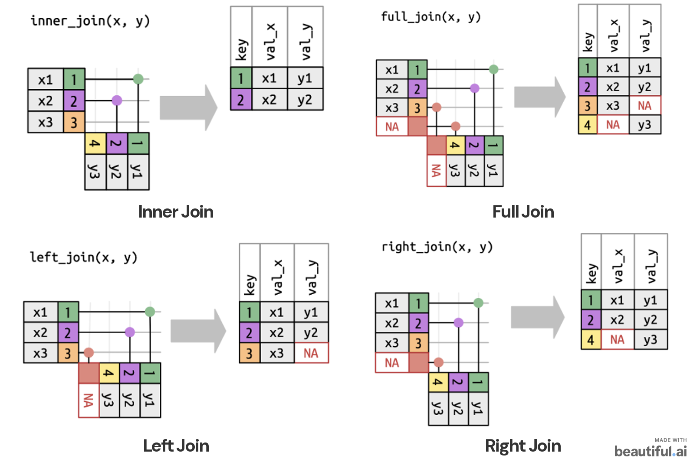

::: {style="height: 80vh; display: flex; align-items: center;"}

::: {.columns .v-center}

::: {.column width="48%"}

### UNIT 1

<span style="color:#1565C0; font-size:0.8em; font-weight:600;">Programming & Reproducible Analysis</span>

Working with R, Python, Jupyter, and Quarto

:::

::: {.column width="52%" style="text-align:center;"}

{width=90%}

<br>

<small>
<em>W.E.B. Du Bois Portrait Gallery:<br>
<strong>Visualizing Black America</strong></em>
</small>

:::

:::

:::

---

## Learning Objective

What we want to accomplish:

> Different programming ecosystems but one workflow.


By the end of this unit, you should be able to:

- explain why we use <span style="color: blue;">**Markdown/Quarto**</span> for reproducible analysis;
- learn seamless integration of <span style="color: blue;">**code, output, and narrative**</span> in an analysis document;
- recognize the basic object types used in <span style="color: blue;">**R and Python**</span>;
- learn constructs to import external data in both languages;
- perform basic data-wrangling tasks such as <span style="color: blue;">**filtering, renaming, creating variables, and joining tables**</span>.

::: {.callout-note}
**Your programming language is a tool, not the goal.**<br> 
We will demonstrate ideas that are transferable across programming languages and show equivalent R and Python code.
:::

```{r}
#| label: setup
#| include: false

library(reticulate)
```

---

# Part 1: Reproducible analysis

<span style="color:#1565C0; font-size:1.8em; font-weight:600;"> From code to an analysis report</span>

---

## Anatomy of a report

A professional analysis report should have the following components:

- **Narrative** — What question are we asking? What did we find?
- **Code** — What did we do to obtain the result?
- **Output** — What did the code produce?
- **Visuals** — Tables, figures, and other evidence.

We use **Markdown** to combine these components into a single document.

---

## What is Markdown?

Markdown is a lightweight markup language to format text using plain-text syntax.

| Goal | Markdown |
|---|---|
| Heading | `# Heading` |
| Subheading | `## Subheading` |
| Bold | `**bold**` |
| Italic | `*italic*` |
| Inline code | `` `mean(x)` `` |
| Bullet | `- item` |

The same Markdown ideas work across **R Markdown, Quarto, and Jupyter Notebooks**.

---

## Quarto: the common publishing layer

**Quarto** lets us combine:

- Markdown narrative
- executable code
- figures and tables
- equations
- citations
- reproducible output

```text
Question
   ↓
Narrative + Code
   ↓
Execute analysis
   ↓
Results + Figures
   ↓
Professional report
```

## Why use it?

- organized code
- professional reports
- seamless integration of analysis and explanation
- the same publishing framework can support **R and Python**

---

## R Markdown and Quarto

R Markdown and Quarto use very similar document structure. Quarto is a more general-purpose publishing platform that supports multiple languages, including R and Python.

### R Markdown

```yaml
---
title: "My Analysis"
output: html_document
---
```

### Quarto

```yaml
---
title: "My Analysis"
format: html
---
```

The key idea is the same:

> **Your document describes both what you want to say and how the analysis was produced.**

---

## Code chunks / cells

In R Markdown / Quarto, code can be controlled through chunk options.

### R

<!-- ```r -->
```{r}
x <- c(1, 2, 3, 4)
mean(x)
```


### Python

<!-- ```python -->
```{python}
x = [1, 2, 3, 4]
sum(x) / len(x)
```

The surrounding syntax differs, but the underlying workflow is the same:

**write code → execute code → inspect output → explain the result**

---

## Showing code vs. showing output

An R code chunk is written as:

````markdown
```{{r, echo=FALSE}}
summary(x)
```
````

```{r, echo=FALSE}
summary(x)
```

Some syntax specifications:

- `echo = TRUE` → show the code
- `echo = FALSE` → hide the code
- `eval = TRUE` → execute the code
- `eval = FALSE` → do not execute the code
- `warning = FALSE` → suppress warnings
- `message = FALSE` → suppress messages

---

## Activity: Your first Quarto report

::: {.callout-important style="font-size:0.75em;"}
## Create your first reproducible analysis in **Quarto**.

Create a new **Quarto document (`.qmd`)** that combines executable code, a short explanation in markdown, and the output.

#### Your task

1. Create a new Quarto document and give it an appropriate **title and author** in the YAML header.

2. Choose **R or Python** and write code that: *creates a collection containing the values `4, 8, 6, 10, 12` and calculates and reports its **mean, minimum, and maximum**.*

3. Add a short **Markdown paragraph** explaining what your code is doing **and** what the results tell you.

4. Render the `.qmd` document to **HTML** and inspect the output. Make sure the narrative, code, and results are all displayed correctly.

5. Open the rendered HTML file in your browser and use **Print → Save as PDF** to create a PDF version of your report.

#### Before submitting

Check that your report contains:

- a title and your name;
- a short narrative explanation;
- executable **R or Python** code;
- the resulting output; and
- a clearly presented interpretation of the results.

#### Submission

Submit **both files** to Brightspace: *Both the source `.qmd` file and the rendered PDF are required.*

- `YourName_Quarto_Activity.qmd`
- `YourName_Quarto_Activity.pdf`

:::

---

# Part 2

<span style="color:#1565C0; font-size:1.8em; font-weight:600;"> Programming basics: objects, values, and functions</span>

---

## Data Types, Data Structures and Objects

Both **R and Python** organize the information we work with as **objects**.

> An object's **type** and **structure** determine what information it represents and what operations can be performed on it.

Broadly speaking, object has:

- a **name**
- a **value**
- a **type / structure** and other attributes
- operations or functions that can act on it

This is an object-oriented way of thinking even when we are not writing formal classes.

---

## Naming objects

#### R

```r
vec1 <- c(1, 2, 3, 4)
```
<br>

#### Python

```python
vec1 = [1, 2, 3, 4]
```
<span style="font-size:0.8em;">Both statements mean:</span>

> <span style="font-size:0.8em;">Create a value and bind it to the name `vec1`.</span>


<span style="color:#1565C0; font-size:1.2em; font-weight:600;"> Naming conventions: </span>
<span style="font-size:0.8em;">Use descriptive names</span>

::: {style="font-size:0.8em;"}

- `percent_below`
- `school_name`
- `prep_time`

Avoid names that hide meaning, such as `x1`, `thing`, or `stuff`, once the analysis becomes substantial.

:::

---

## Assignment is not equality

A common source of confusion:

#### R

```r
x <- 5     # assignment
x == 5     # comparison
```
<br>

#### Python

```python
x = 5      # assignment
x == 5     # comparison
```

In both languages:

::: {style="font-size:0.8em;"}

- **assignment** gives a name a value;
- **`==`** asks whether two values are equal.
:::

---

## Functions

A **function** is a reusable operation that:

::: {style="font-size:0.8em;"}

1. accepts input;
2. performs some computation;
3. may return output.
:::

#### R

```r
mean(x)
summary(x)
```
<br>

#### Python

```python
len(x)
sum(x)
```

---

## Packages and libraries

Packages collect reusable code. **Install** a package once; **import/load** it when you need it.

#### R

Install once:

```r
install.packages("tidyverse")
```

Use in a session:

```r
library(tidyverse)
```
<br>

#### Python

Install once:

```bash
pip install pandas
```

Import into a program:

```python
import pandas as pd
```

---

# Part 3

<span style="color:#1565C0; font-size:1.8em; font-weight:600;"> How data is organized in R and Python</span>

---

## Basic data types

Both R and Python have a small set of **atomic data types** that are the building blocks for more complex structures.

::: {.columns}

::: {.column width="48%"}

#### Basic / atomic R types

| Type | Example |
|---|---|
| logical | `TRUE`, `FALSE` |
| integer | `10L` |
| double | `10.5` |
| character | `"data"` |

:::

::: {.column width="48%"}

#### Basic Python types

| Type | Example |
|---|---|
| `bool` | `True`, `False` |
| `int` | `10` |
| `float` | `10.5` |
| `str` | `"data"` |


:::

:::

::: {.callout-note style="font-size:0.75em;"}
## Remember

- Both R and Python allow arithmetic operations on logical values, treating `TRUE` / `True` as 1 and `FALSE` / `False` as 0. This is an example of **implicit type conversion**.

- R treats even a single string as a **character vector of length 1**, whereas Python treats a string as a sequence of characters. You can see the difference by creating `"Hello"` in both languages and comparing R's `length()` with Python's `len()`.

- Unlike R's built-in `data.frame`, a `DataFrame` is **not a built-in Python data structure**. It is provided by libraries such as **pandas**.
:::

---

## R Data Structures: a useful map

R provides several core data structures for organizing and working with data.  
These structures differ in their **dimensionality**, the **types of values they can contain**, and how their elements are accessed.

<table style="width:100%; table-layout:fixed;">
  <colgroup>
    <col style="width:25%;">
    <col style="width:15%;">
    <col style="width:60%;">
  </colgroup>

  <thead>
    <tr>
      <th>R object</th>
      <th>Dimension</th>
      <th>Key idea</th>
    </tr>
  </thead>

  <tbody>
    <tr>
      <td><strong>Vector</strong></td>
      <td>1-D</td>
      <td>elements share a common atomic type</td>
    </tr>
    <tr>
      <td><strong>Matrix</strong></td>
      <td>2-D</td>
      <td>elements share a common atomic type</td>
    </tr>
    <tr>
      <td><strong>Array</strong></td>
      <td>multi-D</td>
      <td>elements share a common atomic type</td>
    </tr>
    <tr>
      <td><strong>Data frame</strong></td>
      <td>2-D</td>
      <td>each column can have a different type</td>
    </tr>
    <tr>
      <td><strong>List</strong></td>
      <td>1-D container</td>
      <td>elements can be different types or objects</td>
    </tr>
    <tr>
      <td><strong>Factor</strong></td>
      <td>1-D</td>
      <td>categorical values with defined levels</td>
    </tr>
  </tbody>
</table>

These distinctions matter because they determine **what a data structure can contain** and **how we can access and manipulate its elements**.

---

## Python: the closest everyday structures

While there are not like for like equivalents for every R structure in Python, the general idea prevails.

::: {style="font-size:0.75em;"}

| R idea | Python analogue | Important difference |
|---|---|---|
| Vector | `list` / NumPy array | Python lists may mix types |
| Matrix | NumPy array | NumPy arrays are typically homogeneous |
| Array | NumPy array | n-dimensional structure |
| Data frame | pandas `DataFrame` | tabular data by rows and columns |
| List | `list` | general heterogeneous container |
| Factor | `pandas.Categorical` | categorical values with defined categories |

:::

::: {.callout-note style="font-size:0.75em;"}
The goal is **not** to memorize a one-to-one mapping of data structures across languages. The goal is to understand the structural idea and then learn the language-specific implementation.
:::

---

## R vectors

<small>Vectors are **one-dimensional** and generally contain one data type.</small>

```r
vec_num <- c(1, 2, 3, 4)
vec_chr <- c("yes", "no", "maybe")
vec_log <- c(TRUE, FALSE, TRUE)

# appending elements to a vector
vec_num <- c(vec_num, 5)
```
<br>
<small>A useful sequence shortcut is `1:5`. This creates a vector of integers from 1 to 5.</small>

```text
1 2 3 4 5
```

::: {.callout-note}
R and Python handle integer sequences differently:

- In **R**, `1:5` produces `1, 2, 3, 4, 5` — **both endpoints are included**.
- In **Python**, `range(1, 5)` produces `1, 2, 3, 4` — the **stop value `5` is excluded**.

Therefore, the Python equivalent of R's `1:5` would be `range(1, 6)`.
:::

---

## Python lists

The everyday Python list is also one-dimensional, but unlike a basic R vector it can contain mixed types.

```{python}
vec_num = [1, 2, 3, 4]
vec_mixed = [1, 2, False, "yes"]

print(vec_mixed)

# appending elements to a list
vec_num.append(5)
print(vec_num)
```

The mixed list remains a list.

This is a major conceptual difference from a homogeneous R vector.

---

## Guess the output type: R

What type of object is stored in this list?

```r
x <- c(1, 2, FALSE, "yes")
```

Think before running it.<br>

::: {.fragment}

#### Key idea

R vectors are homogeneous, so R **coerces** values to a common type. Because a character value is present, the vector becomes **character**.

```r
x
# [1] "1" "2" "FALSE" "yes"
```
:::

---

## Guess the output type: Python

What type of object is stored in this list?

```{python}
x = [1, 2, False, "yes"]
```
<br>

#### Key idea

Python lists can contain mixed types, so no coercion is required and lists can be heterogeneous.

::: {.callout-note style="font-size:0.75em;"}

## Remember

**R:** homogeneous vector → coercion

**Python:** heterogeneous list → mixed values allowed

:::

---

## Matrices

They are **two dimensional** structures in either language.

::: {.columns}

::: {.column width="50%"}

#### R

```{r}
mat <- matrix(
  c(1, 2, 3, 4),
  nrow = 2,
  ncol = 2
)

mat
```

:::

::: {.column width="50%"}

#### Python / NumPy

```{python}
import numpy as np

mat = np.array([1, 2, 3, 4]).reshape(2, 2)

mat
```

:::

:::


::: {.callout-note style="font-size:0.75em;"}

## Remember

By default, R fills a matrix **column by column** (`byrow = FALSE`).

For the vector `c(1, 2, 3, 4)`:

- the first column receives `1, 2`
- the second column receives `3, 4`

To fill the matrix **row by row** instead, specify `byrow = TRUE`
:::

---

## Matrix indexing

#### R: 1-based indexing

```{r}
mat[1, 2]
```

means:

> row 1, column 2

#### Python: 0-based indexing
```{python}
mat[0, 1]
```

means:

> row 1, column 2

This difference is worth memorizing.

---

## Named Indexing

R organically supports **named indexing** for matrices and even data frames. You can assign names to rows and columns and then use those names to access elements.

```{r}
mat <- matrix(
  c(1, 2, 3, 4),
  nrow = 2,
  dimnames = list(
    c("row1", "row2"),
    c("col1", "col2")
  )
)

mat["row1", "col2"]
```

Python typically uses explicit labels (<span style="color: #1565C0;">*for its rows and columns through index and column names*</span>) through a tabular structure such as a pandas `DataFrame` rather than relying on matrix row/column names in the same way.<br> That's the data structure you will see in the next section and more commonly use during large scale data analysis.

---

## Tabular Data

::: {style="font-size:0.75em;"}
A data frame is a **2-D table** in which rows represent observations, columns represent variables, and columns may have different types.
:::

#### R `data.frame`

```{r}
df <- data.frame(
  name = c("A", "B"),
  score = c(90, 84),
  subject = c("Math", NA)
)
df
```

#### Python `pandas` DataFrame

```{python}
import pandas as pd

df = pd.DataFrame({
    "name": ["A", "B"],
    "score": [90, 84],
    "subject": ["Math", np.nan]
})
df
```

::: {style="font-size:0.75em;"}

Both are designed to deal with tabular data.

:::

---

## Indexing Dataframes

Often we need to probe into specific rows and columns of a data frame. Both R and Python provide multiple ways to access data frame elements.<br><br>

::: {.columns}

::: {.column width="45%" style="font-size:0.75em;"}

#### R
R uses the `[row, column]` syntax to access elements of a data frame.

```{r}
# to access the element in row 1, column 2
df[1, 2]

# to access all columns in row 1
df[1, ]

#to access the score column
df[, "score"]
```

:::

::: {.column width="50%" style="font-size:0.75em;"}

#### Python
Python uses the `.loc` and `.iloc` methods to access elements of a DataFrame. `.loc[]` uses row/column labels, while `.iloc[]` uses their integer positions.

```{python}
# iloc supports integer-based (positional) indexing
df.iloc[0, 1]  # row 0, column 1

# loc supports label-based indexing
df.loc[0, "score"]  # row 0, column "score"

# to print a whole column
df["score"]
```
:::

:::


---

### Missing data require explicit attention

<!-- ===================================================== -->
<!-- STAGE 1: ORIGINAL TWO-COLUMN CONTENT -->
<!-- ===================================================== -->

::: {.fragment .fade-out data-fragment-index="1"
style="position:relative; z-index:1;"}

::: {.columns}

::: {.column width="48%" style="font-size:0.75em;"}

#### R

<small>`NA` represents missingness.</small>

```{r}
# for the whole data frame
is.na(df)

# how many missing values per row
rowSums(is.na(df))

# count missing values in a specific column
sum(is.na(df$score))

# ignore missing values when calculating the mean
mean(df[, "score"], na.rm = TRUE)
```

:::

::: {.column width="48%" style="font-size:0.75em;"}

#### Python

<small>Pandas commonly uses `NaN` for missing values.</small>

```{python}
# check for missing values in whole data frame
df.isna()

# count missing values in a specific column
df["score"].isna().sum()

# number of rows with missing values in any column
df.isna().any(axis=1).sum()
```

:::

:::

:::


<!-- ===================================================== -->
<!-- STAGE 2: EXPLANATION OF ROWS WITH ANY MISSING VALUE -->
<!-- ===================================================== -->

::: {.fragment .fade-in data-fragment-index="1"
style="position:absolute; top:25%; left:12%; width:76%; z-index:5;"}

::: {.callout-tip style="font-size:0.72em;"}

## **How many observations have at least one missing value?**

### R

```r
rowSums(is.na(df)) > 0
```

- `is.na(df)` identifies missing cells.
- `rowSums(...)` counts missing values **within each row**.
- `> 0` identifies rows with **at least one** missing value.

### Python

```python
df.isna().any(axis=1)
```

- `df.isna()` identifies missing cells.
- `.any(axis=1)` asks whether **any column** in each row contains a missing value.
- `.sum()` counts the rows for which the answer is `True`.

:::

:::


<!-- ===================================================== -->
<!-- STAGE 3: FINAL MISSINGNESS NOTE -->
<!-- ===================================================== -->

::: {.fragment .fade-in data-fragment-index="2"
style="position:absolute; top:75%; left:12%; width:76%; z-index:10;"}

::: {.callout-note style="font-size:0.75em;"}

## What you are missing can be key information.

- Do not silently ignore missing values. Missingness can be informative and may require special handling.
- Missingness can be **random** or **systematic**. If it is systematic, it may bias your results.
- Missingness can introduce errors in your analysis if not handled properly.

:::

:::

---

## Heterogeneous Lists

#### R

```{r}
x <- list(
  number = 1,
  flag = FALSE,
  word = "yes",
  values = c(1, 2, 3)
)
```

#### Python 

```{python}
x = [
    1,
    False,
    "yes",
    [1, 2, 3]
]
```

::: {.callout-note style="font-size:0.75em;"}

### Remember
- A list is a **heterogeneous container for objects/data types**.

- R lists can contain vectors, matrices, data frames, or other lists.

- The major difference in these structures across the two language ecosystems is in the way they are indexed and accessed, and that R lists can have **named** elements.
:::

---

## Indexing: a comparison

| Goal | R | Python |
|---|---|---|
| First element | `x[1]` | `x[0]` |
| Second element | `x[2]` | `x[1]` |
| Last element | `x[length(x)]` | `x[-1]` |
| Named column in table | `df$col1` | `df["col1"]` |

<br>

#### Remember

**R starts at 1. Python starts at 0 which is more in line with the convention across most programming languages.**

---

## R: `[ ]` versus `[[ ]]` versus `$`

There are few ways you can access lists in R. These are worth understanding early on.

::: {.columns}

::: {.column width="33%"}

#### `[ ]` — Subset

```{r}
x[1]
```

<!-- returns:

```text
$number
[1] 1
``` -->

<small>The result is still a **list** containing one element.</small>

```{r}
typeof(x[1])
```

:::

::: {.column width="33%"}

#### `[[ ]]` — Element

```{r}
x[[1]]
```

<!-- returns:

```text
[1] 1
``` -->

<small>The result is the **object stored inside** the list.</small>

```{r}
typeof(x[[1]])
```

:::

::: {.column width="33%"}

#### `$` — Extract by name

```{r}
x$number
```

<!-- returns:

```text
[1] 1
``` -->

<small>This extracts an element using its **name** rather than its position.</small>

```{r}
typeof(x$number)
```

:::

:::

<br>

::: {.callout-note}
## The key distinction

- `x[1]` asks: **give me a subset of the list** → object returned remains a list.
- `x[[1]]` asks: **give me the object inside position 1** → hence the surrounding list structure is removed.
- `x$number` asks: **give me the object named `number`** → convenient when list elements have meaningful names.
:::

---

## Python indexing tools

Python commonly uses square brackets:

```{python}
x[0]
x[-1]
df["score"]
```

For a dictionary that is indexed by keys, you can use the key name to extract the value:

```python
person["name"]
```

---

## Categorical data

::: {style="font-size:0.75em;"}
Some variables represent a **fixed set of categories** rather than arbitrary text.

Examples:

- `"ELA"`, `"Math"`, `"Science"`
- `"Freshman"`, `"Sophomore"`, `"Junior"`, `"Senior"`

:::

::: {.columns}

::: {.column width="48%" style="font-size:0.75em;"}

#### R: `factor`

```{r}
subject <- factor(
  c("Math", "ELA", "Math", "Science")
)

subject
levels(subject)
```

A factor stores categorical values using a set of **levels**.

:::

::: {.column width="48%" style="font-size:0.75em;"}

#### Python: `pandas.Categorical`

```{python}
import pandas as pd

subject = pd.Categorical(
    ["Math", "ELA", "Math", "Science"]
)

subject
subject.categories
```

A pandas `Categorical` represents values using a defined set of **categories**.

:::

:::

<div style="position:relative; height:32vh;">

::: {.fragment .fade-out data-fragment-index="1" style="position:absolute; top:0; left:5%; width:90%; z-index:2;"}

::: {.callout-tip style="font-size:0.75em;"}

## Think about it

Why might we want to represent a categorical variable as a **factor** (R) or **categorical variable** (pandas) rather than simply storing it as a string?

Give **1–2 reasons**.

:::

:::


::: {.fragment .fade-in data-fragment-index="1" style="position:absolute; top:0; left:5%; width:90%; z-index:3;"}

::: {.callout-note style="font-size:0.72em;"}

## Why does this matter?

- Storing categories as strings can lead to errors and inconsistencies (capitalization, typos, etc.). Using a factor or categorical variable makes an explicit set of valid categories.

- The **definition and ordering of categories** can affect how results are displayed and interpreted.

:::

:::

</div>

---

## Ordered data

Sometimes categories have a meaningful order. For examples, the months of the year, or a rating scale such as *Low < Medium < High*. Often observations need to be compared or sorted based on this order.

::: {.columns}

::: {.column width="48%" style="font-size:0.75em;"}

#### R
The **levels** tell R the intended ordering.

```{r}
month <- factor(
  c("Dec", "Apr", "Jan", "Mar"),
  levels = c(
  "Jan", "Feb", "Mar", "Apr", "May", "Jun",
  "Jul", "Aug", "Sep", "Oct", "Nov", "Dec"
  ),
  ordered = TRUE
)

print(sort(month))
```

:::

::: {.column width="48%" style="font-size:0.75em;"}

#### Python / pandas

The **categories** and `ordered=True` tell pandas how the values should be ordered.

```{python}
rating = pd.Categorical(
    ["Medium", "Low", "High", "Low"],
    categories=["Low", "Medium", "High"],
    ordered=True
)

rating.sort_values()
```

:::

:::

::: {.callout-note style="font-size:0.72em;"}
## Remember

Note that if entries do not match the defined levels or categories, they will be treated as **missing values** or `NA`. This is a common source of confusion when working with categorical data especially in R where missing values can be contagious to subsequent operations.
:::

---

## Dates and Times

::: {style="font-size:0.75em;"}
These commonly appear on your datasets. Dates may **look like strings**, but representing them as actual dates allows us to sort, compare, and calculate with them. Consider:

```text
"2026-08-27"
```

It helps to make this a specialized **date** object rather than a string so that the computer understands its position in time.

:::

::: {.columns}

::: {.column width="48%" style="font-size:0.75em;"}

### R

```{r}
date <- as.Date("2026-08-27")

date
class(date)
```

:::

::: {.column width="48%" style="font-size:0.75em;"}

### Python / pandas

```{python}
date1 = pd.to_datetime(
    "2026-08-27"
)

date2 = pd.to_datetime(
    "2026-08-30"
)

elapsed_time = date2-date1
elapsed_time
```

:::

:::

::: {.callout-tip style="font-size:0.75em;"}
## Note

Once dates are represented correctly, we can perform operations such as calculating elapsed time.<br>
Learn more about date and time handling in R and Python here:

- R: [Dates and Times](https://r4ds.had.co.nz/dates-and-times.html)
- Python: [Time Series](https://pandas.pydata.org/docs/user_guide/timeseries.html)

:::

---

## Bonus: Tibbles

::: {.callout-note style="font-size:0.75em;"}

A **tibble** is the tidyverse's modern version of an R `data.frame`.

```{r}
library(tibble)

students <- tibble(
  name = c("A", "B", "C"),
  score = c(82, 91, 88)
)

students
```

A tibble is still a **2-D tabular object**:

- rows represent **observations**
- columns represent **variables**
- different columns can have **different types**

### Why tibbles?

Compared with a traditional `data.frame`, tibbles provide some conveniences for data analysis:

- cleaner printing of large datasets
- natural integration with the **tidyverse**
- many `dplyr` operations naturally return tibbles

:::

---


# Part 4

<span style="color:#1565C0; font-size:1.8em; font-weight:600;"> Reading data into an analysis </span>

---

## Finding the data

Before loading a dataset, it is important to know **where the data lives**.

- Downloads folder?
- Project folder?
- `data/` folder? $\rightarrow$ <span style="color:#1565C0;">good practice is to keep data in a dedicated folder within your project directory</span>
- Somewhere else?

A professional project should have a predictable directory structure.

```text
project/
├── data/
├── figures/
├── notebooks/
└── reports/
```

---

## Understanding the relative file path

<small> A file path tells the us where a file lives relative to our current working directory. Suppose your project directory is organized as follows:</small>

```text
DS3100/
├── data/
│   └── my_data.csv
│
└── Unit_01/
    └── analysis.qmd
```
<br>

::: {.fragment .fade-out data-fragment-index="1"}

::: {.columns}

::: {.column width="48%"}

#### `./` — Current directory

<small> If your current directory is `DS3100/` then</small>

```text
./data/my_data.csv
```

> <span style="font-size:0.75em;">Start **here**, enter the `data` folder, and find `my_data.csv`.</span>

<small> So the path resolves to `DS3100/data/my_data.csv`</small>

:::

::: {.column width="48%"}

#### `../` — Parent directory

<small> If your current directory is `DS3100/Unit_01/` then</small>

```text
../data/my_data.csv
```

> <span style="font-size:0.75em;">Go **up one level** from `Unit_01` to `DS3100`, then enter the `data` folder.</span>

<small> So the path resolves to `DS3100/data/my_data.csv`</small>

:::

:::

:::

::: {.fragment .fade-in data-fragment-index="1" style="position:absolute; top:60%; left:15%; width:70%; z-index:10;"}

::: {.callout-note style="font-size:0.75em;"}
## Reading relative paths

- `./` → start in the **current directory**
- `../` → move to the **parent directory** (one folder level up)
- `../../` → move **two directory levels up**
- `data/` → enter a folder named `data`

Paths are read from **left to right**, one directory at a time.
:::

:::

---

## Locating the current file path

Obtaining the path to the current working directory is a useful first step.

#### R

```{r}
getwd()
```

<br>

#### Python

```{python}
import os
os.getcwd()
```

---

## Path separators

Modern Python code should generally use `/` even on Windows, or use `pathlib` for portable paths.<br>

#### Python

```{python}
from pathlib import Path

path = Path("data") / "tenn2018.csv"
print(path)
```
<br>

#### R

```{r}
"data/tenn2018.csv"
```

The important idea is **relative paths**: to make your analysis work from your project directory you need to evaluate the paths of assets relative to that directory.

---

## Knowing your file type

Common formats include:

| Extension | Typical use |
|---|---|
| `.csv` | comma-separated table |
| `.txt` | text / delimited data |
| `.xlsx`, `.xls` | Excel |
| `.RData`, `.rds` | R objects/data |
| `.sav` | SPSS |
| `.dat` | generic / statistical software |
| `.sas7bdat` | SAS |
| `.mat` | MATLAB |

The extension helps you choose the right reader.

---

## Loading the data

::: {style="font-size:0.75em;"}

This is where file extension matters. Different file types require different readers.<br>
Here we write some code to load data from a CSV file into a dataframe in memory. The syntax differs, but the reasoning is the same: **file → reader → object in memory**

:::

<div style="position: relative; height: 55vh;">

::: {.fragment .fade-out data-fragment-index="1" style="position:absolute; top:0; left:10%; width:80%;"}

#### R

`head()` is a base R function that returns the first few rows of a data frame.

```{r}
ten <- read.csv("data/tenn2018.csv")

knitr::kable(
  head(ten, n=2),
  format = "html"
)
```

:::


::: {.fragment .fade-in data-fragment-index="1" style="position:absolute; top:0; left:10%; width:80%; z-index:10;"}

#### Python

`head()` is a pandas method that returns the first few rows of a DataFrame.

```{python}
import pandas as pd
from IPython.display import HTML
# Force pandas to display all columns
pd.set_option('display.max_columns', None)

ten = pd.read_csv("data/tenn2018.csv")

HTML(
    ten.head(2).to_html(index=False)
)
```

:::

</div>

---

## Other file formats

#### R

<small>Reading RData, R's native binary format:</small>

```r
load("data/tenn2018.RData")
```

<small>For SPSS, data coming from the SPSS (*Statistical Package for the Social Sciences*) software suite:</small>

```r
library(haven)
ten <- read_sav("data/tenn2018.sav")
```
<br>

#### Python

<small>For Excel:</small>

```python
pd.read_excel("data/tenn2018.xlsx")
```

<small>For SPSS, common Python tools include `pyreadstat` or pandas interfaces built around it.</small>

::: {.callout-note}
When you encounter an unfamiliar file format, it is important knowing how to **find the appropriate reader and read its documentation**.
:::

---

## The data-loading checklist

Before analysis, ask:

1. What function/package should I use?

2. What does the documentation say?

3. What object will the function to load data return?

4. Did the data load correctly?

5. Do the variables have the types and values I expect?

> **Never assume that a successful import means the data were read correctly.**

---

## Activity: Tennessee education data

::: {.callout-important style="font-size:0.75em;"}
### 💻 Your turn

Using **R or Python**, read `tenn2018.csv` into a data frame called `ten`. Use what you have learned about **data frames, objects, and indexing** to answer the following:

1. Print the first seven observations in `ten`.

2. Determine the **number of rows and columns** in the data frame.

3. Print the **column names**. How many different variables are available? How many do you think are categorical?

4. Access and print the `overall_subject` column.

5. In the `pandas` documentation, look up `.loc[]` and `.iloc[]`. What is the difference between these two methods?

    In R, the equivalent task can be performed using the `[row, column]` operator and R's 1-based indexing. Now answer the following:

    - Access the value of `district_name` for the **first observation**.
    - Access the value of `percent_below` for the **first observation**.

6. **Bonus**: How many columns in this dataset have **missing values**? List all of them.

:::

::: {.callout-tip style="font-size:0.75em;"}

### 📚 Need a reference?
If you get stuck, consult the documentation for your language:

- **R:** [R Documentation — Data Frames](https://search.r-project.org/R/refmans/base/html/data.frame.html)
- **R indexing:** [R Documentation — Select Parts of a Data Frame](https://www.r-bloggers.com/2024/04/mastering-rows-selecting-by-index-in-r/)
- **Python / pandas:** [pandas — Intro to Data Structures](https://pandas.pydata.org/docs/user_guide/dsintro.html)
- **pandas indexing:** [pandas — Indexing and Selecting Data](https://pandas.pydata.org/pandas-docs/stable/user_guide/indexing.html)

**Part of the activity is learning how to find what you need in documentation.**

:::

---

# Part 5

<span style="color:#1565C0; font-size:1.8em; font-weight:600;"> Data wrangling</span>

---

## What is data wrangling?

> <medium>**Data wrangling is the process of transforming raw data into a clean, structured, and usable format for analysis.**</medium>

::: {style="font-size:0.8em;"}

A useful way to think about a table:

- **Variables** are columns.
- **Observations** are rows.
- **Values** are the individual entries.

:::

<small>Most early data-wrangling tasks change, reorganize, or create one or more of these dimensions.</small>

::: {.callout-note style="font-size:0.75em;"}
## Tidy data

Hadley Wickham's **tidy data** framework provides a useful standard for organizing tabular data:

1. Each **variable** forms a column.
2. Each **observation** forms a row.
3. Each **value** occupies a cell.

A tidy dataset therefore has a consistent structure in which **columns represent variables and rows represent observations**.
:::

---

## Core wrangling operations

We will practice:

::: {style="font-size:0.8em;"}
1. **Subsetting / filtering** rows
2. **Selecting** columns
3. **Renaming** variables
4. **Creating** variables
5. **Handling missing values**
6. **Appending** observations
7. **Joining** tables
:::

These operations are conceptually the same in R and Python.

---

## Filtering rows: R

<small>Using `dplyr`: R package for **data manipulation**. Provides functions for common data-wrangling tasks such as filtering, selecting, renaming, grouping and summarizing data. <br>
The `filter()` function asks *which rows satisfy the condition I specify*?</small>

```{r}
library(dplyr)
df <- data.frame(
  school = c("A", "B", "C", "D"),
  overall_subject = c("ELA", "Math", "ELA", "Math"),
  percent_below_cap = c(12.5, NA, 18.2, 9.7)
)
```

#### Example 1. Remove observations with missing values
```{r}
filtered <- df %>%
  filter(!is.na(percent_below_cap))
filtered
```

::: {.callout-note style="font-size:0.75em;"}
`NA` is R's standard representation of a **missing value**. So

```r
!is.na(percent_below_cap)
```

can be read as `percent_below_cap` is **not missing**.
:::

---

## Filtering rows: R

#### Example 2. Filter to one subject
Suppose we only want observations for the subject **ELA**.

```{r}
filtered <- df %>%
  filter(overall_subject == "ELA")
filtered
```

<br>

::: {style="font-size:0.8em;"}

1. `df` → start with the data frame.
2. `%>%` → pass that data frame to the next operation.
3. `is.na(percent_below_cap)` → asks whether each value of `percent_below_cap` is missing.
4. `!` → means **NOT**, so `!is.na(...)` identifies values that are **not missing**.
5. `filter()` → keeps only rows for which that condition is `TRUE`.

:::

---

## Filtering rows: Python

<small>In python, the primary means to read datasets and perform data manipulation is through the popular open-source `pandas` library.</small>

#### Example 1: Remove observations with missing values

<small>Suppose we want to keep only rows where `percent_below` has a recorded value.</small>
```{python}
df = pd.DataFrame({
    "school": ["A", "B", "C", "D"],
    "overall_subject": ["ELA", "Math", "ELA", "Math"],
    "percent_below_cap": [12.5, None, 18.2, 9.7]
})
filtered = df[df["percent_below_cap"].notna()]
filtered
```

#### Example 2: Keep observations from one category

<small>Suppose we want to keep only observations for the subject **ELA**.</small>
```{python}
filtered = df[df["overall_subject"] == "ELA"]
filtered
```

---

## AND and OR conditions

::: {style="font-size:0.8em;"}
Suppose we want to filter out observations that satisfy **both** of the following conditions:

> `overall_subject == "ELA"` **AND** `percent_below_cap >= 20`
:::

#### R

```{r}
df %>%
  filter(overall_subject == "ELA" & percent_below_cap >= 20)
```

<br>

#### Python

```{python}
df[
    (df["overall_subject"] == "ELA") &
    (df["percent_below_cap"] >= 20)
]
```

## AND and OR conditions

For conditions joined by `OR` where satisfying either condition is sufficient:

#### R

```{r}
df %>%
  filter(overall_subject == "ELA" | percent_below_cap >= 20)
```

<br>

#### Python

```{python}
df[
    (df["overall_subject"] == "ELA") |
    (df["percent_below_cap"] >= 20)
]
```

::: {.callout-warning}
In pandas, put each condition in parentheses when combining conditions with `&` or `|`.
:::

---

## Membership: `%in%` versus `in`

#### R:

```{r}
df <- data.frame(
  school = c("A", "B", "C", "D", "E", "F"),
  state = c("TN", "KY", "VA", "GA", "NC", "TN"),
  score = c(82, 91, NA, 88, 85, 94),
  percent_below_cap = c(12.5, NA, 18.2, 9.7, 4.2, 15.3)
)
df %>%filter(state %in% c("TN", "KY", "GA"))
```

#### Python:

```{python}
df = pd.DataFrame({
    "school": ["A", "B", "C", "D", "E", "F"],
    "state": ["TN", "KY", "VA", "GA", "NC", "TN"],
    "score": [82, 91, None, 88, 85, 94],
    "percent_below_cap": [12.5, None, 18.2, 9.7, 4.2, 15.3]
})
df[df["state"].isin(["TN", "KY", "GA"])]
```

## Checking a single value

To ask whether `"TN"` appears anywhere in the `state` column:

::: {.columns}

::: {.column width="48%"}

#### R

```{r}
"TN" %in% df$state
```

:::

::: {.column width="48%"}

#### Python

```{python}
"TN" in df["state"].values
```

:::

:::

<br>

The conceptual question is the same:

> **Is this value a member of this set?**

---

## Renaming variables

#### R

```{r}
df <- df %>%
  rename(
    school_name = school
  )
df
```

#### Python

```{python}
df = df.rename(columns={
    "school": "school_name"
})
df
```

<br>

Same operation:

> **Change the label, not the underlying values.**

---

## Creating a new variable

Suppose `df` contains the percentage of students below a given threshold in the current and previous periods and we want to create a new variable that measures the difference between the two.

#### R
<small>In `dplyr`, `mutate()` is used to **create new variables (columns)** or modify existing ones.</small>

```r
df <- df %>%
  mutate(
    diff = percent_below_cap - percent_below_cap_previous
  )
```

#### Python

```python
df["diff"] = (
    df["percent_below_cap"] -
    df["percent_below_cap_previous"]
)
```

This is a central data-science pattern:

> **new variable = transformation of existing variables**

---

## Summaries

A **summary statistic** reduces a variable to a useful numerical description, such as its mean, median, minimum, or maximum.

#### R

<small>Calculate the mean of the `score` column:</small>

```{r}
mean(df$score, na.rm = TRUE)
```

<small>Here, `df$score` selects the `score` column, while `na.rm = TRUE` tells R to **ignore missing values** when calculating the mean. In R `na.rm` stands for "NA remove".</small>

::: {.callout-warning}
Missing data in R is contagious and the presence of `NA` values can propagate through calculations returning `NA` as the answer. Therefore, it is important to explicitly handle missing values when computing summary statistics.
:::


#### Python

```{python}
df["score"].mean()
```

<small>Here, `df["score"]` selects the `score` column and `.mean()` calculates its mean. By default, pandas ignores missing values when computing the mean.</small>


---

## Grouped summaries in R

::: {style="font-size:0.8em;"}
*What is the average `percent_below_cap` for each school?*<br>
Sometimes we want a summary **for each group** rather than one value for the entire dataset.
:::

```{r}
df %>%group_by(school_name) %>%
  summarize(
    mean_percent_below_cap = mean(percent_below_cap, na.rm = TRUE)
  )
```

::: {.callout-note style="font-size:0.75em;"}
- `group_by(school_name)` divides the observations into groups by school.
- `summarize()` calculates a summary for **each group**.
- `mean_percent_below_cap` is the name of the newly created summary variable.
:::

::: {.callout-tip style="font-size:0.75em;"}
## Think about it

**Why does School B remain in the resulting tibble showing the grouped summary even though we used `na.rm = TRUE`?**
:::

## Grouped summaries in Python

::: {style="font-size:0.8em;"}
*What is the average `percent_below_cap` for each school?*<br>
Sometimes we want a summary **for each group** rather than one value for the entire dataset.
:::


```{python}
df.groupby("school_name")["percent_below_cap"].mean()
```

<br>

::: {.callout-note style="font-size:0.75em;"}
- `.groupby("school_name")` groups observations by school.
- `["percent_below_cap"]` selects the variable to summarize.
- `.mean()` calculates its mean **separately for each school**.
:::

---

## Appending observations in R

<small>Sometimes new data contain **additional observations with the same variables** as an existing dataset.<br>
Suppose we have two tables containing information about different schools.<br>
</small>

```{r}
df1 <- data.frame(
  school = c("A", "B"),
  state = c("TN", "KY"),
  score = c(82, 91)
)
df2 <- data.frame(
  school = c("C", "D"),
  state = c("GA", "TN"),
  score = c(88, 94)
)
combined <- bind_rows(df1, df2)
combined
```

::: {.callout-note style="font-size:0.75em;"}

`bind_rows()` places the observations in `df2` **underneath** those in `df1`.

:::


## Appending observations in Python

<small>Think of **append = add observations**.</small>

```{python}
df1 = pd.DataFrame({
    "school": ["A", "B"],
    "state": ["TN", "KY"],
    "score": [82, 91]
})

df2 = pd.DataFrame({
    "school": ["C", "D"],
    "state": ["GA", "TN"],
    "score": [88, 94]
})

combined = pd.concat([df1, df2],ignore_index=True)
combined
```

::: {.callout-note style="font-size:0.75em;"}

- `pd.concat()` combines the two DataFrames vertically.  
- `ignore_index=True` creates a new sequential row index for the combined DataFrame.
:::

---

## Activity: Appending DataFrames with Different Columns

::: {.callout-tip style="font-size:0.8em;"}
## Your turn

Create **two small data frames** that do **not** have exactly the same columns.

1. Give both data frames at least **two columns in common**.
2. Give `df1` a column that is **not present in `df2`**.
3. Give `df2` a different column that is **not present in `df1`**.
4. Append the observations in `df2` to `df1`.
5. Print the resulting data frame and inspect it carefully.

**What happens to the columns that are not shared by both data frames?**

Try this in **R or Python**, depending on the language you are working with.
:::
<br>

> **Before running your code:** Predict the number of rows and columns the resulting data frame will have. What do you expect to see where information is unavailable?

---

## Joining tables: R

<small>A **join** combines information from two tables by matching values of a shared **key**.<br>
Suppose one table contains school locations and another contains school scores. Here, `school_number` is the **key** shared by both tables.
</small>

```{r}
schools <- data.frame(
  school_number = c(101, 102, 103),
  school_name = c("Central", "West", "East")
)
scores <- data.frame(
  school_number = c(101, 102, 104),
  score = c(82, 91, 88)
)

left_join(
  schools,
  scores,
  by = "school_number"
)
```

<small>A **left join** keeps every row from `schools` and adds matching information from `scores`.</small>

::: {.callout-note style="font-size:0.7em;"}
`full_join(schools, scores, by = "school_number")` would instead keep **all keys from both tables**, including school `104`.
:::

---

## Joining tables: Python

<small> In `pandas`, the `merge()` function is used to join two DataFrames based on a common key. The `how` parameter specifies the type of join.<br>
The pandas equivalent of a full join is specified with the parameter `how="outer"`. Again, in this example, `school_number` is the **key** used to match observations.
</small>

```{python}
import pandas as pd

schools = pd.DataFrame({
    "school_number": [101, 102, 103],
    "school_name": ["Central", "West", "East"]
})
scores = pd.DataFrame({
    "school_number": [101, 102, 104],
    "score": [82, 91, 88]
})
schools.merge(
    scores,
    on="school_number",
    how="outer"
)
```

::: {.callout-note style="font-size:0.7em;"}
Think of a join as: **match observations using a key → bring their information together**

Unlike appending, a join does not simply place one table underneath another.
:::

---

## Join types

::: {.columns .v-center}

::: {.column width="50%"}

::: {style="font-size:0.75em;"}

| Concept | R | pandas |
|---|---|---|
| **Inner** | `inner_join()` | `how="inner"` |
| **Left** | `left_join()` | `how="left"` |
| **Right** | `right_join()` | `how="right"` |
| **Full** | `full_join()` | `how="outer"` |

:::

<br>

<span style="font-size:0.8em;">
The **join type determines which keys/rows are retained**.
</span>

:::

::: {.column width="50%"}

{width=95%}

:::

:::

---

## Activity: What will each join produce?

::: {.callout-tip style="font-size:0.72em;"}
## ✏️ Pen-and-paper first

Consider these two tables:

::: {.columns}

::: {.column width="45%"}

**Table A**

| key | x |
|---:|:---|
| 1 | x1 |
| 2 | x2 |
| 3 | x3 |

:::

::: {.column width="45%"}

**Table B**

| key | y |
|---:|:---|
| 2 | y2 |
| 4 | y4 |

:::

:::

**Without writing any code**, draw the resulting table for each join:

1. **Inner join**
2. **Left join** — Table A is the left table
3. **Right join** — Table A is the left table
4. **Full / outer join**

For each result, ask yourself: *Which `key` values should remain, and where should missing values appear?*

:::

<br>

#### 💻 Now test your predictions

<small>Create Table A and Table B in **R or Python**, then perform all four joins using `key` as the matching variable.<br>
**Compare the outputs with your predictions. Were you right?**</small>

---

## Wrap-up: 

### What should feel familiar across languages?

The syntax changes but the thinking does not

```text
Question
   ↓
Data
   ↓
Select / transform
   ↓
Summarize
   ↓
Interpret
   ↓
Communicate
```

---

## Before the next class

Make sure you can:

::: {.callout-note style="font-size:0.75em;"}

- open a `.qmd` or `.ipynb` file in VS Code;
- run a simple **Python** notebook;
- run a simple **R** notebook;
- identify the first element of a sequence in each language;
- create a simple vector/list;
- read a CSV file;
- explain the difference between a **row**, **column**, and **value**;
- explain what a **data frame / DataFrame** is;
- filter a table using one condition.

:::

**Bring your questions to class! 😄**

