::: {style="height: 80vh; display: flex; align-items: center;"}

::: {.columns .v-center}

::: {.column width="48%"}

### UNIT 2

<span style="color:#1565C0; font-size:0.8em; font-weight:600;">Exploratory Data Analysis & Data Visualization</span>

Working with GGPlot, Matplotlib and more

:::

::: {.column width="52%" style="text-align:center;"}

{width=90%}

<br>

<small>
<em>W.E.B. Du Bois Portrait Gallery:<br>
<strong>Visualizing Black America</strong></em>
</small>

:::

:::

:::

---

## Learning goals

By the end of this section, you should be able to:

- explain **Exploratory Data Analysis**: *what it can and cannot do*;
- identify distributions, unusual observations, and relationships;
- choose a visualization based on **variable types and the question**;
- create and interpret common plots in **R or Python**;
- use visualization principles to make a graphic **clear, effective and trustworthy**.

```{r}
#| label: setup
#| include: false

library(reticulate)
library(tidyverse)
library(GGally)
```

```{python}
import pandas
import matplotlib.pyplot as plt
```

---

## Two concomitant lines of thought

::: {.columns}

::: {.column width="50%" style="font-size:0.8em;"}

### <span style="color:#1565C0;">John Tukey</span> — Exploratory Data Analysis

Use data to **look, question, compare, and discover**.

- What is common?
- What is unusual?
- What varies?
- What relationships deserve attention?

:::

:::  {.column width="50%" style="font-size:0.8em;"}

### <span style="color:#1565C0;">Edward Tufte</span> — Data Visualization

Make quantitative graphics **clear, truthful, efficient, and informative**.

- Show the data.
- Avoid distortions.
- Make comparison easy.
- Remove unnecessary decoration.

:::

:::

> **EDA helps us discover interesting patterns within data; visualization helps make those structure visible.**

::: {.footer}
Tukey, *Exploratory Data Analysis* (1977); Tufte, *The Visual Display of Quantitative Information* (1983).
:::

---

## What is EDA?

::: {style="font-size:0.75em;"}

<span style="color:#1565C0;">**Exploratory Data Analysis (EDA)**</span> is a way of using **summaries and visualizations to understand the data we have** and decide what is worth investigating.

For example, recall the clinic dataset containing data on fictional outpatient visits. It included each patient’s clinic, age, waiting time, and visit status. Some questions that the dataset initially reveal:

- What does the distribution of **waiting times** look like?
- Are there unusually long waits?
- Do Cardiology and Primary Care appear to have different waiting times?
- Does waiting time appear to vary with **age**?
- Are there patterns we did **not expect**?

> **EDA is about discovering and describing patterns — not deciding whether those patterns are statistically significant or causal.**

:::

::: {.callout-tip style="font-size:0.75em;"}

**EDA reveals:** *what is going on in our observed data.* Our central question beyond that remains what patterns or unusual features deserve further investigation.

:::

---

## EDA vs. Confirmatory Data Analysis

::: {style="font-size:0.75em;"}

<span style="color:#1565C0;">**Confirmatory Data Analysis (CDA)**</span> uses **pre-specified questions, statistical models, and inference** to evaluate whether the evidence supports a particular claim or hypothesis and to quantify uncertainty.

The distinction becomes clearer when we flesh out the questions we ask at two different stages.

| **Exploratory** | **Confirmatory / Inferential** |
|---|---|
| *In our clinic data, Cardiology patients appear to wait longer than Primary Care patients.* | *Is there evidence that average waiting times differ between Cardiology and Primary Care patients?* |
| *How large is the difference we observe?* | *What is the estimated difference in the population?* |
| *Are there unusual patients or clinics that might be driving the pattern?* | *How uncertain is our estimate?* |
| *Does the relationship between age and blood pressure look roughly linear, nonlinear, or absent?* | *Is age associated with blood pressure in the population?* |
| *What patterns deserve further investigation?* | *What conclusions are supported by the analysis, and how uncertain are they?* |

:::

::: {.callout-note style="font-size:0.75em;"}

**A useful progression:**

**Explore → formulate a question → analyze → quantify uncertainty**

EDA can **motivate** a formal analysis, but the exploratory pattern itself is not the inference.

For example, a plot may suggest that Cardiology patients wait longer. A formal analysis might estimate the difference and report a **confidence interval** to quantify uncertainty around that estimate.

:::

---

## The EDA loop

```text
question
   ↓
inspect
   ↓
clean / transform
   ↓
summarize
   ↓
visualize
   ↓
notice something
   ↓
ask a better question
   ↺
```

EDA is **iterative**, not a checklist that ends after a certain set of plots. Instead, we go back and forth to refine our argument.

---

## Start with the data, not the plot

Before making a visualization:

1. Identify the **unit of observation**.
2. Understand variable types and ranges.
3. Check missingness and suspicious values.
4. Decide what observations are relevant to the question.
5. Identify the comparison or relationship you want to see.

> **A plot cannot rescue a poorly understood dataset.**

---

## Let your question choose your viz

| What do you want to see? | Useful starting point |
|---|---|
| Distribution of one numeric variable | Histogram / density / boxplot |
| Counts of categories | Bar chart |
| Numeric variable across groups | Grouped boxplot / density |
| Relationship between two numeric variables | Scatterplot |
| Same relationship across groups | Color / shape / facets |
| Many numeric variables | Scatterplot matrix |

There is no universally “best” plot. The **question determines the job** of the graphic.<br>

::: {.callout-important style="font-size:0.75em;"}

Good visualization is not decoration added after analysis. It is part of how we reason about the data and communicate what we learned.

:::

---

# Tools for Data Visualization

<span style="color:#1565C0; font-size:1.8em; font-weight:600;"> GGPlot and Matplotlib</span>

---

## Grammar of Graphics

::: {style="font-size:0.72em;"}

The **Grammar of Graphics** is a formal rule-based framework proposed by **Leland Wilkinson**.

Think of it as a way to describe statistical graphics as combinations of independent components. `ggplot2` adapts this idea into a practical layered system. ([Wilkinson, 2005](https://link.springer.com/book/9780387245447); [ggplot2 book](https://ggplot2-book.org/introduction))

:::

::: {.columns}

::: {.column width="40%" style="font-size:0.72em;"}

### What we plot?

**Data**  
→ the observations we want to visualize

**Visual encodings / aesthetics**  
→ how variables are represented visually

Examples: position → x- and y-axis; color; size; shape

**Geometric objects**  
→ the marks used to represent the data

Examples: points; bars; lines; boxes

:::

::: {.column width="60%" style="font-size:0.72em;"}

### How do we organize graphic?

**Scales**  
→ translate data values into visual properties and define how they are displayed

**Statistics**  
→ calculate or summarize what is shown

**Facets**  
→ split the data into separate panels

**Coordinates**  
→ determine how the spatial system is arranged

**Theme / annotations**  
→ control appearance and add explanatory elements

:::

:::

::: {.callout-note style="font-size:0.72em;"}

### A useful mental model

**Data → Visual encodings → Geometric marks → Scales / statistics → Facets / coordinates → Final graphic**

:::

---

## ggplot2: Read grammar, not syntax

We make a plot by specifying what data to use, what to show on your plot and how to display it.

```{r}
#| echo: false
#| include: false

ten <- read.csv("data/tenn2018.csv")

p <- ggplot(
  ten,
  aes(
    x = percent_below,
    y = percent_on_mastered,
    color = overall_subject
  )
) +
  geom_point()
```


::: {.columns}

::: {.column width="52%"}

```{r}
#| eval: false

ggplot(
  ten,
  aes(
    x = percent_below,
    y = percent_on_mastered,
    color = overall_subject
  )
) +
  geom_point()
```

::: {.fragment .fade-in}

::: {.callout-note style="font-size:0.75em;"}

### What's going on here?

Start with the Tennessee data.

- Put `percent_below` on the x-axis.**

- Put `percent_on_mastered` on the y-axis.**

- Map `overall_subject` to color.**

- Draw the observations as points.**

:::

:::

:::

::: {.column width="48%"}

```{r}
#| echo: false
#| fig-width: 5
#| fig-height: 4

p
```

:::

:::

This type of visual lens is **language agnostic** and can apply to
libraries like `Altair` as well.

---

## Anatomy of a plot

::: {style="font-size:0.72em;"}

| Component | What it does | Example |
|---|---|---|
| Data | supplies observations | `data = ten` |
| Aesthetics | Maps variables to visual properties <br>: position, color, size, shape, etc. | `aes(x, y, color)` |
| Geometries | Geometric objects on your plot to represent data | `geom_point()` |
| Scales | How values are mapped into axes, colors, sizes etc. | `scale_x_*()` |
| Statistics | Transformations or summarizes | `stat_*()` / `geom_smooth()` |
| Facets | Multi-view plots with smaller panels<br> each focussing on different subsets of data | `facet_wrap()` |
| Coordinates | How the plot's coordinate system is arranged | `coord_flip()` |
| Theme | The visual appearance: fonts, grids, spacing, titles, etc. | `theme()` |

:::

---

## The same idea in Python

Python has several graphics libraries rather than one single dominant grammar.

- **matplotlib** — low-level figure and axes control
- **seaborn** — concise statistical graphics
- **plotnine/Altair** — implementations inspired directly by the Grammar of Graphics

The conceptual structure remains:

> **data → mappings → marks → scales/layout → annotations**

---

## R and Python: different syntax, same questions

| Analytical question | R / `ggplot2` | Python / seaborn |
|---|---|---|
| What data? | `ggplot(data=...)` | `data=...` |
| What goes on x/y? | `aes(x=..., y=...)` | `x=...`, `y=...` |
| What marks? | `geom_*()` | plot function / `kind=` |
| What group? | `color`, `fill`, facets | `hue`, `style`, facets |
| What layout? | `facet_*()` | `FacetGrid`, `row`, `col` |
| What styling? | `theme()` / scales | matplotlib / seaborn options |

> **The API changes; the analytical decisions do not.**

---

# Univariate Visualization

<span style="color:#1565C0; font-size:1.8em; font-weight:600;"> One variable at a time</span>

---

## First thoughts

::: {style="font-size:0.72em;"}

When we examine **one variable at a time**, our first goal is to understand
how its values are distributed.

For example, for a patient's **waiting time**:

- Where are most observations?
- How much do the values vary?
- Is the distribution symmetric or skewed?
- Are there gaps or multiple clusters?
- Are there unusually large or small observations?

:::

::: {.callout-tip style="font-size:0.72em;"}

### First question

> **What does the distribution of this variable look like?**

To answer this, we must know what kind of plot is required. A histogram, density plot, or boxplot would probably be our visual starting point.

:::

---

## Histogram

A histogram groups numeric values into evenly sized **bins** and counts observations in each bin.

::: {.columns}

::: {.column width="48%" style="font-size:0.8em;"}

#### R / `ggplot2`

```r
ten_plot <- ten %>%
  filter(!is.na(percent_below))

p_ggplot <- ggplot(
  ten_plot,
  aes(x = percent_below)
) +
  geom_histogram(
    bins = 15,
    boundary = min(ten_plot$percent_below),,
    fill = "blue"
  )
```

#### Python / `matplotlib.pyplot`

```python
ten = pd.read_csv("data/tenn2018.csv")
plt.hist(
    ten["percent_below"].dropna(),
    bins=15,
    color="blue",
)
plt.xlabel("Percent Below")
plt.ylabel("Frequency")
plt.show()
```

:::

::: {.column width="52%" style="font-size:0.8em;"}

<div style="position: relative; width: 100%; height: 420px;"> 

<div class="fragment fade-in" style="position: absolute; top: 0; left: 0; width: 100%;">

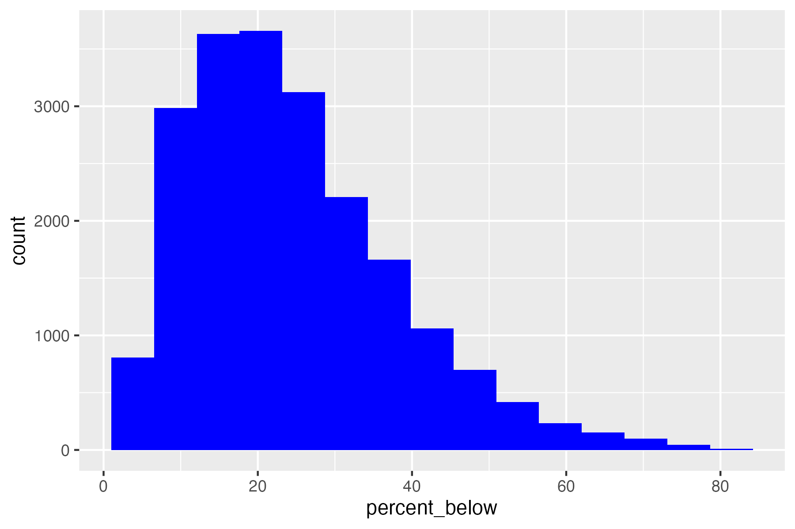

</div> 

<div class="fragment fade-in" style="position: absolute; top: 0; left: 0; width: 100%;">

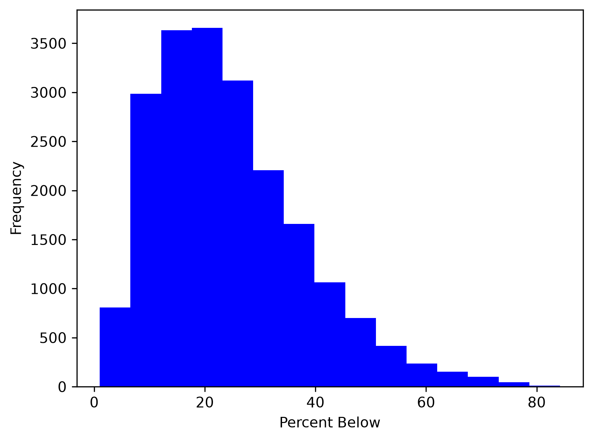

</div>

</div>

:::

:::

---

### Histograms: the binning problem

::: {style="font-size:0.72em;"}

A reasonable bin width is key to capturing the **overall shape** of the distribution.

- Broad bins can **hide important structure**.
- Very narrow bins can make **random variation look like meaningful structure**.

:::

<div style="display:flex; gap:1%; width:100%;">

<div style="width:32%; text-align:center;">

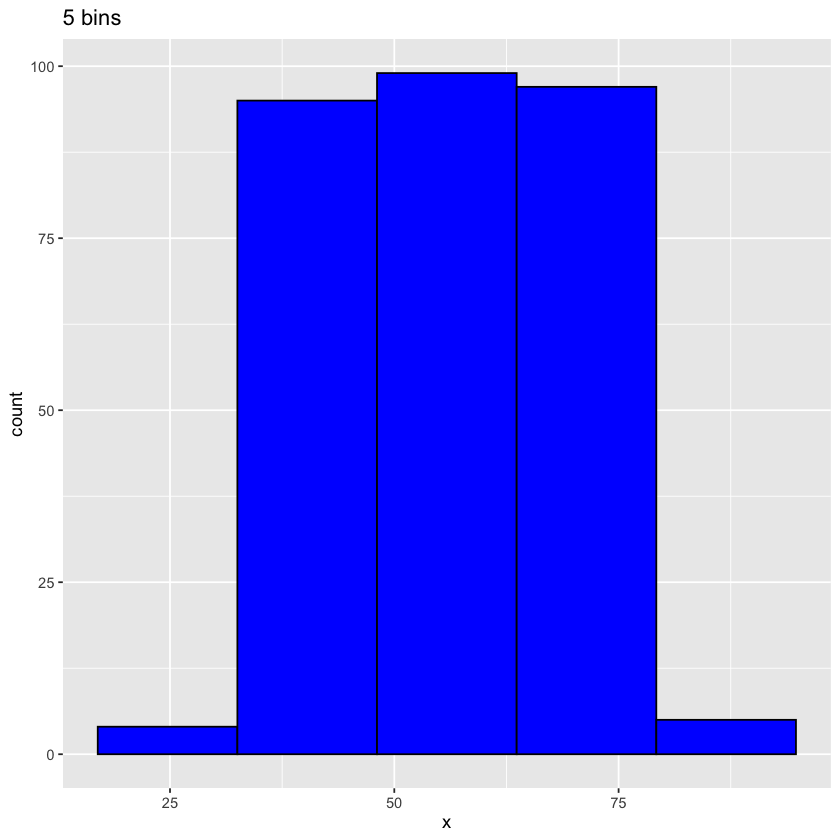{width=100%}

</div>

<div style="width:32%; text-align:center;">

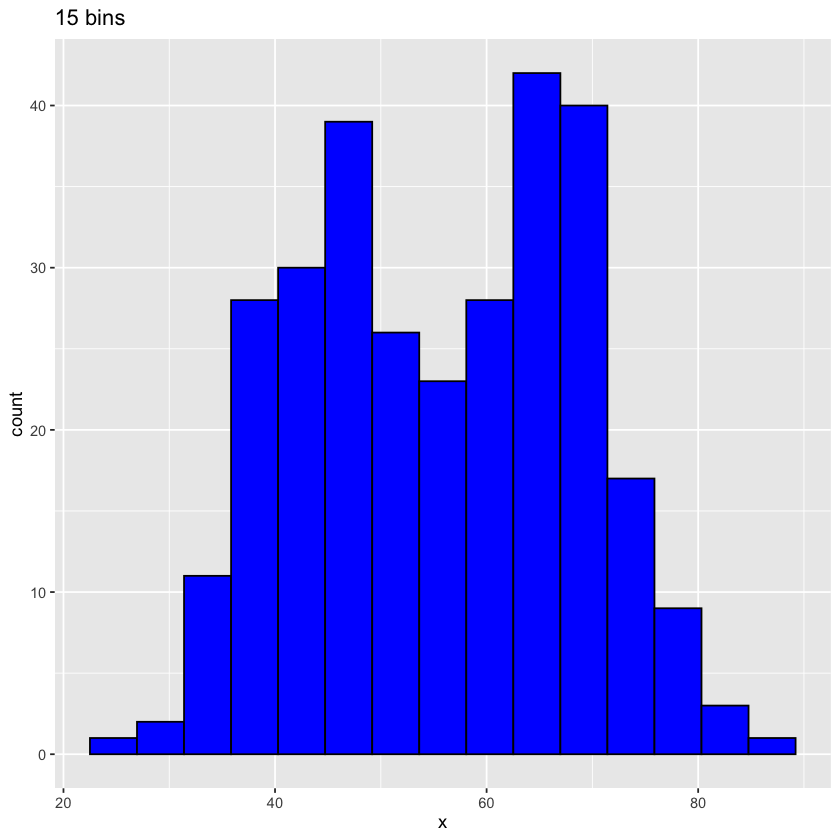{width=100%}

</div>

<div style="width:32%; text-align:center;">

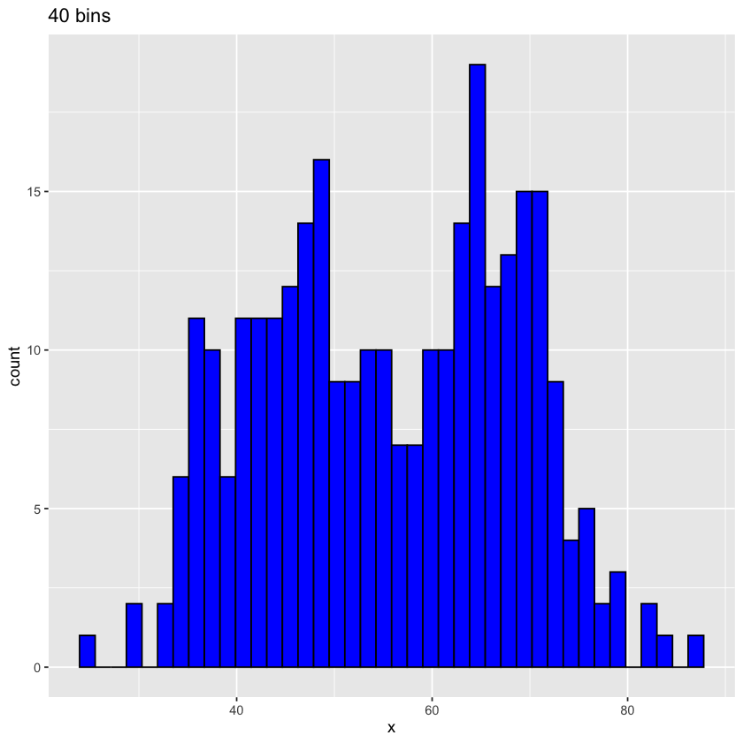{width=100%}

</div>

</div>

::: {.callout-tip}

::: {style="font-size:0.70em;"}

**EDA question:** How sensitive is the apparent shape of the distribution to the choice of bin width?

The binning should help the reader see meaningful structure without manufacturing patterns. There is no single universally correct number of bins.<br>
Try several reasonable bin widths before deciding what the distribution looks like.

:::

:::

---

### Histogram : Extreme Values

::: {style="font-size:0.72em;"}
Suppose we have some data on students in a class that contains their GPA. Our GPA variable is expected to range from **0 to 4**.
:::

::: {.columns}

::: {.column width="48%" style="font-size:0.72em;"}

#### R / `ggplot2`

```r
load("./Unit_02/data/PluckData.RData")
hist(
  dataset$GPA,
  breaks = 10,
  main = "GPA with an improbable value",
  xlab = "GPA"
)
```

#### Python/Matplotlib

```python
plt.hist(
    dataset["GPA"].dropna(),
    bins=10
)

plt.title("GPA with an improbable value")
plt.xlabel("GPA")
plt.ylabel("Frequency")
plt.show()
```
::: {.callout-warning style="font-size:0.72em;"}

### What went wrong?

The histogram uses the full observed range, from about 2 to `999`. Almost all legitimate GPAs are squeezed into the first bin, while the value 999, which is probably an encoding for a missing value, occupies the far end of the range.

> The problem is not the number of bins but that an implausible value has distorted the range being binned.

:::

:::

::: {.column width="48%" style="font-size:0.72em;"}

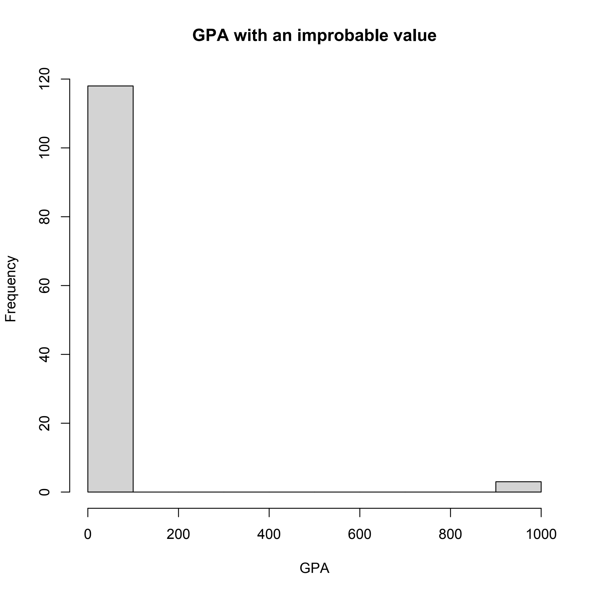

:::

:::

::: {.callout-tip style="font-size:0.72em;"}

#### EDA lesson

An unexpected visualization should prompt us to inspect the underlying data **before interpreting the distribution**. Here you can eliminate all values outside of the expected range `(0,4)` and encode them as missing/`NA`/`NaN` to filter them out.

:::


---

## Density plot

::: {style="font-size:0.72em;"}

A density plot gives a **smoothed, continuous representation** of a numeric distribution via kernel density estimation. It attempts to show the probability density of the data

Useful when comparing overlapping distributions.

:::

::: {.columns}

::: {.column width="48%" style="font-size:0.72em;"}

#### R

```r
ten_plot <- ten %>%
  filter(!is.na(percent_below))

ggplot(
  ten_plot,
  aes(x = percent_below)
) +
  geom_density()
```

#### Python

```python
from scipy.stats import gaussian_kde

x = ten["percent_below"].dropna()
kde = gaussian_kde(x)
x_grid = np.linspace(x.min(), x.max(), 200)

plt.plot(x_grid, kde(x_grid))
plt.xlabel("Percent Below")
plt.ylabel("Density")

plt.show()
```

:::

::: {.column width="52%" style="font-size:0.72em;"}

<div style="position: relative; width: 100%; height: 420px;"> 

<div class="fragment fade-in" style="position: absolute; top: 0; left: 0; width: 100%;">

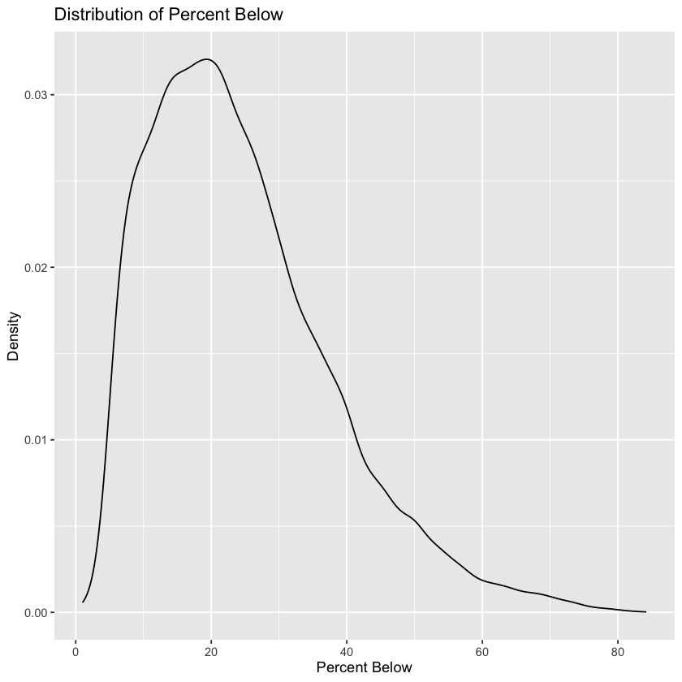

</div> 

<div class="fragment fade-in" style="position: absolute; top: 0; left: 0; width: 100%;">

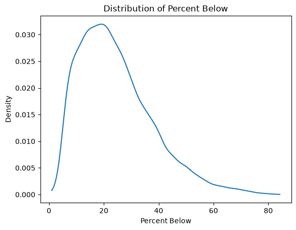

</div>

</div>

:::

:::

::: {.fragment .fade-in}

::: {.callout-note style="font-size:0.72em;"}
Smoothing is itself a choice. A density plot is not the raw data; it is a representation of the data's distribution.
:::

:::

---

### Customizations in GGPlot

::: {.columns}

::: {.column width="48%" style="font-size:0.72em;"}

```r
my_theme <- theme(
  panel.background = element_blank(),
  axis.line = element_line(
    linewidth = 0.50,
    lineend = "square"
  ),
  axis.text = element_text(size = 10),
  axis.title = element_text(size = 12),
  plot.title = element_text(
    size = 14,
    hjust = 0.50
  )
)

ggplot(
  ten_plot,
  aes(
    x = percent_below
  )
) +
  geom_density(
    color = "#1565C0",
    fill = "#6292b9",
    alpha = 0.5
  ) +
  labs(
    title = "Distribution of Percent Below",
    x = "Percent Below",
    y = "Density"
  ) +
  my_theme
```
:::

::: {.column width="48%" style="font-size:0.72em;"}

<div style="position: relative; width: 100%; height: 420px;">

<div class="fragment fade-in"
     style="position: absolute; top: 0; left: 0; width: 100%; z-index: 1;">

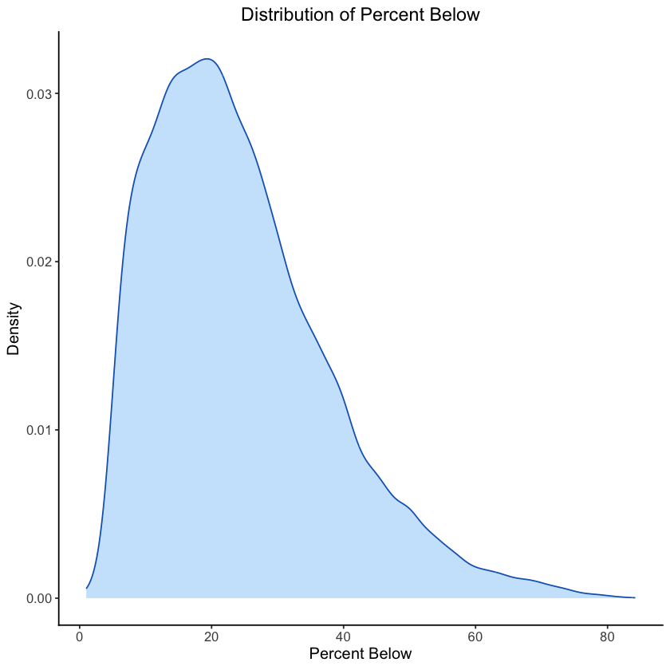

</div>

<div class="fragment fade-in"
     style="
       position: absolute;
       top: 65%;
       left: 5%;
       width: 100%;
       z-index: 5;
     ">

::: {.callout-note style="font-size:0.82em; background-color:#f4f8fc !important;"}

#### <span style="color:#1565C0;">What are we controlling?</span>

1. **`color`** controls the outline of the density curve.

2. **`fill`** controls the area underneath the curve.

3. **`alpha`** controls the transparency of the fill.

4. **`my_theme`** stores reusable plot-wide styling choices such as fonts of axes, legends and title appearance.

In `ggplot2`, parts of a plot can be stored as objects and reused:

```r
plot1 + my_theme
plot2 + my_theme
plot3 + my_theme
```

Here, `color` and `fill` are fixed properties of the plot because we assign them specific values outside `aes()`. If instead we place `color` or `fill` inside `aes()`, they become **aesthetic mappings**.<br>
ggplot uses color to visually encode the values of a variable, such as different categories (*more on this later*).

:::

</div> 

</div>

:::

:::


---

### Boxplot

::: {style="font-size:0.72em;"}

A boxplot is especially useful for **comparing distributions across groups**. It summarizes a numeric distribution using:

::: {.columns}

::: {.column width="10%"}
**1. Median**
:::

::: {.column width="25%"}
**2. First and third quartiles**
:::

::: {.column width="25%"}
**3. Interquartile range (IQR)**
:::

::: {.column width="25%"}
**4. Potential outliers**
:::

:::

:::

::: {.columns}

::: {.column width="48%" style="font-size:0.68em;"}

#### R

```r
ten_plot <- ten %>%filter(!is.na(percent_below))
ggplot(
  ten_plot,
  aes(
    x = "",
    y = percent_below
  )
) +
  geom_boxplot(
    width = 0.4,
    color = "black",
    fill = "lightblue"
  )+
  labs(
    title = "Distribution of Percent Below",
    x = NULL,
    y = "Percent Below"
  )
```

#### Python

::: {.scroll-code}

```python
plt.figure(figsize=(4, 6))
plt.boxplot(
    ten_plot,
    vert=True,
    widths=0.4,
    # Box
    boxprops={
        "facecolor": "white",
        "edgecolor": "black"
    },
    # Median
    medianprops={
        "color": "orange"
    },
)
```

:::

:::

::: {.column width="52%" style="font-size:0.68em;"}

<div style="position: relative; width: 100%; height: 420px;"> 

<div class="fragment fade-in" style="position: absolute; top: 0; left: 0; width: 100%;">

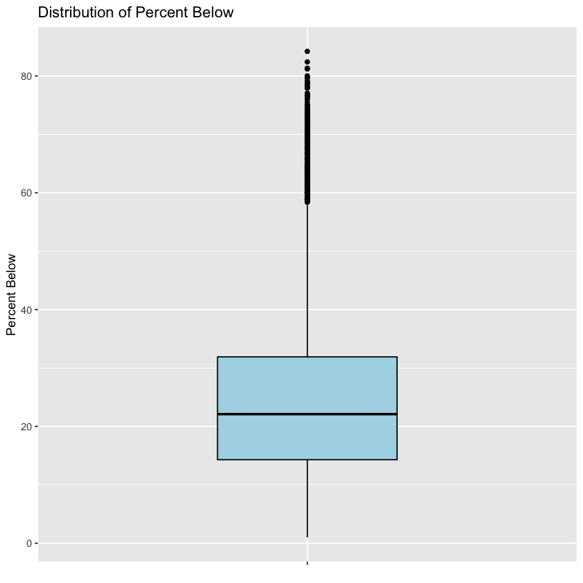

</div> 

<div class="fragment fade-in" style="position: absolute; top: 0; left: 0; width: 100%;">

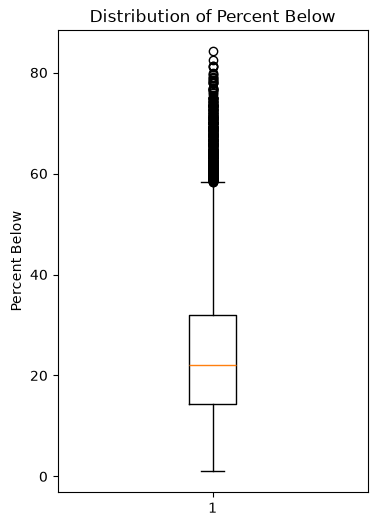

</div>

</div>

:::

:::

---

### Reading a boxplot

::: {.columns}

::: {.column width="48%" style="font-size:0.72em;"}

<div style="height:400px; display:flex; align-items:center; justify-content:center;">


```text
        ─────── upper whisker
        │
     ┌───────┐
     │       │  Q3
     ├───────┤  median
     │       │  Q1
     └───────┘
        │
        ─────── lower whisker

        •  possible outlier
```
</div>

:::

::: {.column width="52%" style="font-size:0.72em;"}

<div style="height:400px; display:flex; align-items:center; justify-content:center;">


</div>

:::

:::

::: {.fragment .fade-in}

::: {.callout-note style="font-size:0.72em;"}

The upper and lower whiskers typically extend from the upper and lower quartiles of the data to the maximum and minimum points, provided they fall within a “reasonable” range. Point beyond that show up as separate dots and are called “outliers”.

The exact definition of “outlier” depends on the plotting convention; in a standard Tukey boxplot, points beyond 1.5 × IQR are flagged.

:::

:::

---

## Reading distribution shape

::: {style="font-size:0.82em;"}

Histograms and Boxplots are key to understanding not just the standout summary numbers but also the shape of a distribution and where most of the data points are gathered.

:::

::: {.columns}

::: {.column width="55%" style="font-size:0.72em;"}

### Skewness

Checks if one tail longer than the other?

**Negative / left skew**: longer tail toward smaller values; $mean < median$

**Approximately symmetric**: left and right sides are broadly balanced; mean and median are roughly similar

**Positive / right skew**: longer tail toward larger values; $mean > median$

:::

::: {.column width="45%" style="font-size:0.72em;"}

### Kurtosis

Kurtosis describes the **relative heaviness of the tails and concentration
around the center** of a distribution.

- **Higher kurtosis** → relatively heavier tails and more extreme observations
- **Lower kurtosis** → relatively light, thin tails and fewer extreme outliers

:::

:::

::: {.callout-note style="font-size:0.72em;"}

### Takeaways

In a **histogram**, look for a longer tail on one side.

In a **boxplot**, compare the lengths of the whiskers and the position of the
median within the box.

A histogram helps you **see** the shape. The mean and median in a boxplot help you **summarize** where the data are centered.

> **Use both: ask what the distribution looks like, then check whether the numerical summaries tell the same story.**

:::

---

## Bar charts

::: {style="font-size:0.72em;"}

For categorical variables, we often want **counts, frequencies, or proportions**.

:::


::: {.columns}

::: {.column width="48%" style="font-size:0.72em;"}

#### R

```r
ten_subject <- ten %>%
  filter(
    !is.na(overall_subject),
    trimws(overall_subject) != ""
  )

ggplot(
  ten_subject,
  aes(x = overall_subject)
) +
  geom_bar(
    fill = "blue"
  )
```

#### Python

```python
ten_subject = ten["overall_subject"].dropna()
ten_subject = ten_subject[
    ten_subject.str.strip() != ""
]

subject_counts = ten_subject.value_counts()

plt.bar(
    subject_counts.index,
    subject_counts.values
)
```
:::

::: {.column width="52%" style="font-size:0.72em;"}

<div style="position: relative; width: 100%; height: 420px;"> 

<div class="fragment fade-in" style="position: absolute; top: 0; left: 0; width: 100%;">

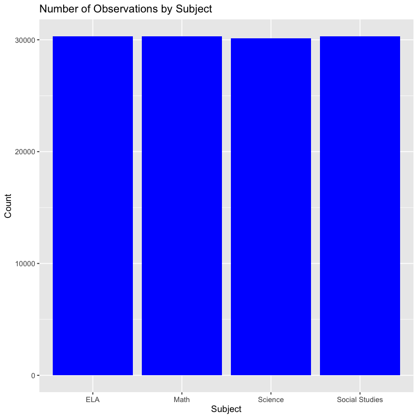

</div> 

<div class="fragment fade-in" style="position: absolute; top: 0; left: 0; width: 100%;">

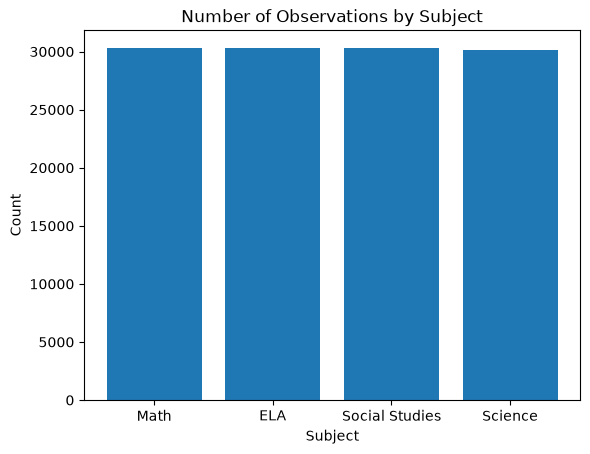

</div>

</div>

:::

:::

::: {.fragment .fade-in}

::: {.callout-warning style="font-size:0.72em;"}

A bar chart is **not** a substitute for a histogram even if they look the same.

> A bar chart compares **categories**; a histogram displays a **numeric distribution**.

:::

:::

---

# Bivariate visualization

<span style="color:#1565C0; font-size:1.8em; font-weight:600;">How are two variables related?</span>

---

## Scatterplot

::: {style="font-size:0.72em;"}

For two numeric variables, the natural starting point is usually a **scatterplot**. With a scatterplot we can get a sense of the strength and direction of the correlation as well the form, clusters as well as potential outliers.

:::

::: {.columns}

::: {.column width="48%" style="font-size:0.72em;"}

#### R

```r
ten_scatter <- ten %>%
  filter(
    !is.na(percent_below),
    !is.na(percent_on_mastered)
  )

ggplot(
  ten_scatter,
  aes(
    x = percent_below,
    y = percent_on_mastered
  )
) +
  geom_point(
    color = "blue"
  )
```

#### Python

```python
ten_scatter = ten[
    ten["percent_below"].notna() &
    ten["percent_on_mastered"].notna()
]

plt.figure(figsize=(6, 4))
plt.scatter(
    ten_scatter["percent_below"],
    ten_scatter["percent_on_mastered"],
    c = "blue"
)
```

:::

::: {.column width="52%" style="font-size:0.72em;"}

<div style="position: relative; width: 100%; height: 420px;"> 

<div class="fragment fade-in" style="position: absolute; top: 0; left: 0; width: 100%;">

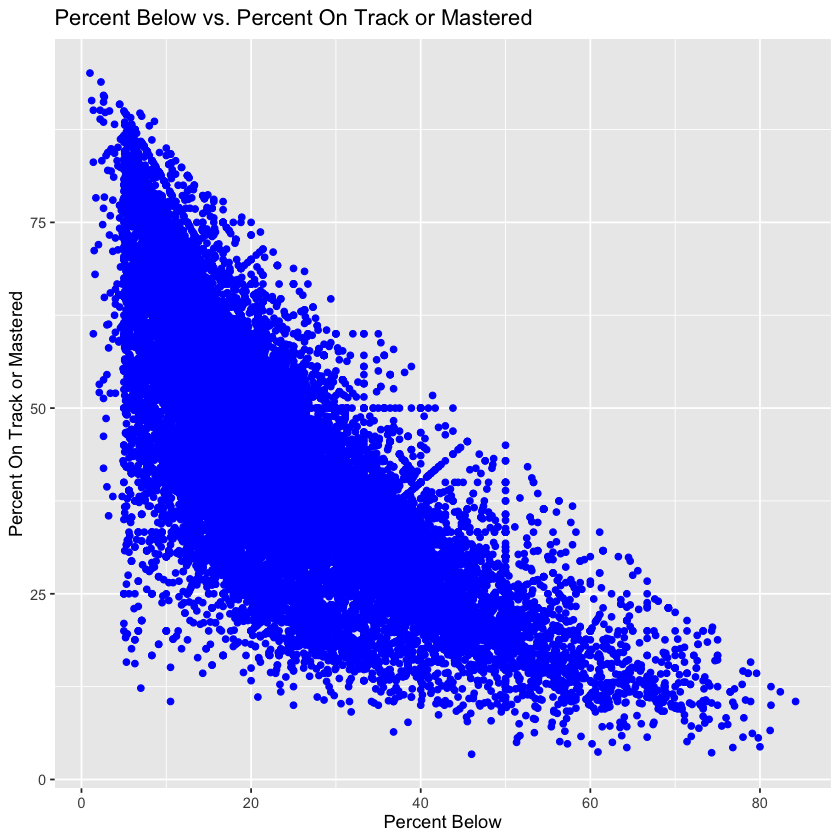

</div> 

<div class="fragment fade-in" style="position: absolute; top: 0; left: 0; width: 100%;">

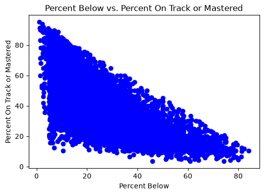

</div>

</div>

:::

:::

---

## Relationships are not always linear

A scatterplot can reveal patterns that a correlation or summary statistic can hide:

- curves
- thresholds
- clusters
- influential observations
- changing spread

::: {.callout-tip}
**Plot first, model second.** If you plan to use a linear model, inspect whether a linear relationship looks plausible.
:::

---

## Adding a fitted line

Can help summarize the **direction** of a relationship, but **not an evidence of causality**.

::: {.columns}

::: {.column width="48%" style="font-size:0.72em;"}

#### R

```r
ggplot(
  ten_scatter,
  aes(
    x = percent_below,
    y = percent_on_mastered
  )
) +
  geom_point() +
  geom_smooth(
    method = "lm",
    se = FALSE
  ) +
  labs(
    title = "Percent Below vs. Percent On Track or Mastered",
    x = "Percent Below",
    y = "Percent On Track or Mastered"
  )
```

#### Python

```python
x = ten_scatter["percent_below"]
y = ten_scatter["percent_on_mastered"]

# Fit a straight line
slope, intercept = np.polyfit(x, y, 1)

plt.figure(figsize=(6, 4))
plt.scatter(x, y)
plt.plot(
    x,
    slope * x + intercept
)

plt.title("Percent Below vs. Percent On Track or Mastered")
plt.xlabel("Percent Below")
plt.ylabel("Percent On Track or Mastered")
```

:::

::: {.column width="52%" style="font-size:0.72em;"}

<div style="position: relative; width: 100%; height: 420px;"> 

<div class="fragment fade-in" style="position: absolute; top: 0; left: 0; width: 100%;">

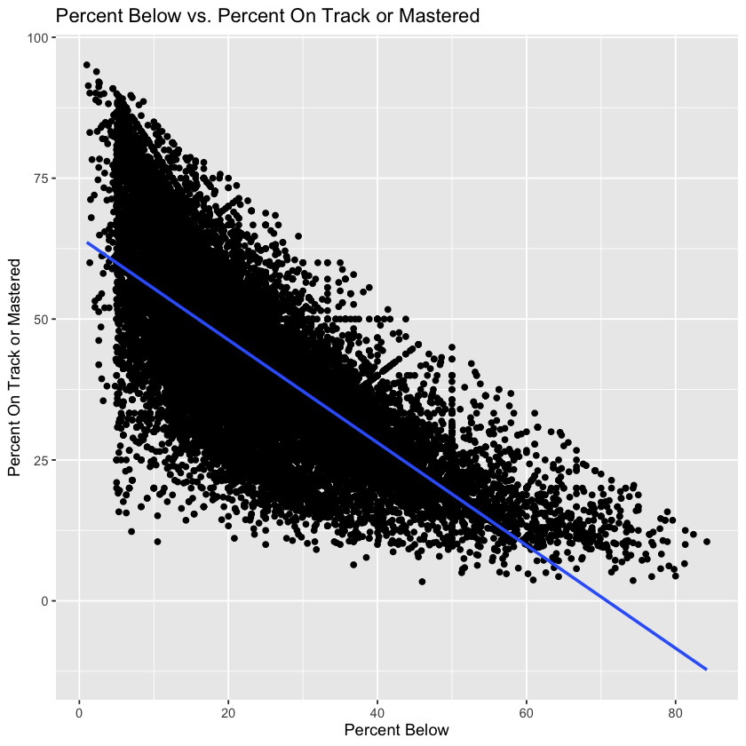

</div> 

<div class="fragment fade-in" style="position: absolute; top: 0; left: 0; width: 100%;">

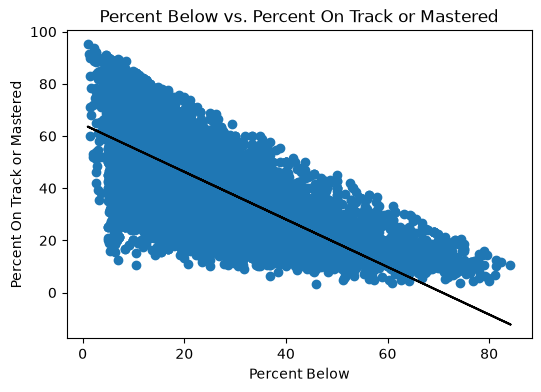

</div>

</div>

:::

:::

---

## Adding a third variable

::: {style="font-size:0.72em;"}

A third variable can be represented using:

- color
- shape
- size
- facets

:::


::: {.columns}

::: {.column width="48%" style="font-size:0.72em;"}

#### R

```r
ggplot(
  ten_scatter,
  aes(
    x = percent_below,
    y = percent_on_mastered,
    color = overall_subject
  )
) +
  geom_point()
```

#### Python

```python
for subject in ten_scatter["overall_subject"].unique():
    subject_data = ten_scatter[
        ten_scatter["overall_subject"] == subject
    ]

    plt.scatter(
        subject_data["percent_below"],
        subject_data["percent_on_mastered"],
        label=subject
    )
```

:::

::: {.column width="52%" style="font-size:0.72em;"}

<div style="position: relative; width: 100%; height: 420px;"> 

<div class="fragment fade-in" style="position: absolute; top: 0; left: 0; width: 100%;">

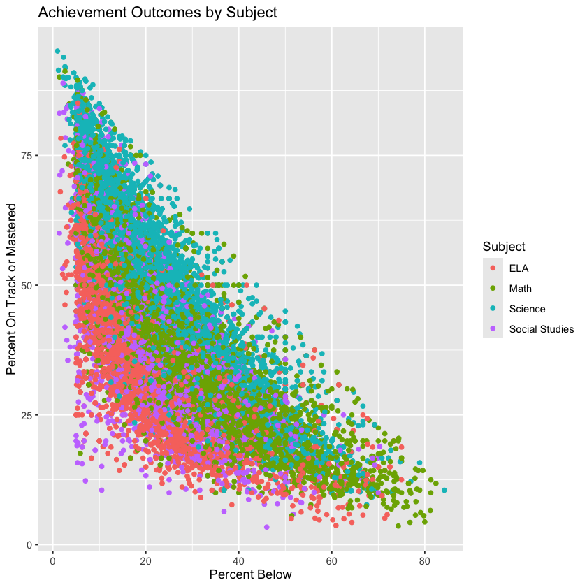

</div> 

<div class="fragment fade-in" style="position: absolute; top: 0; left: 0; width: 100%;">

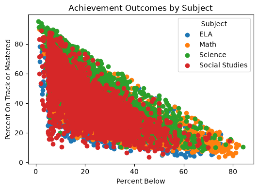

</div>

</div>

:::

:::

---

## When color helps—and when it doesn't

Color can make groups easier to distinguish, but it can also create clutter.

> **You need only look at the last two plots to realize this**

Use a legend when the group identity matters. Remove redundant encodings when it does not or when it does not add visual distinction.

::: {.callout-tip}
Each visual variable should have a clear job. **Do not map variables to aesthetics just because an option exists.**

> **Alternative**: Opt for faceting!
:::

---

## Faceting

Faceting shows the same basic plot separately for groups. This can make comparisons easier because the visual structure is repeated but clutter is avoided.

::: {.callout-tip}

### Faceting is your friend when

- groups answer the **same question**;
- a common axis makes comparison easier;
- separate legends would become cumbersome.

:::

::: {style="font-size:0.72em;"}

In `ggplot2` you have two options:

- `facet_wrap()`: splits data based on **one grouping variable** into separate panels and wraps them across rows/columns to fit the available space
- `facet_grid()`: organizes panels to define a structured **row × column grid**, typically using two grouping variables

In `matplotlib` you have to implement the underlying logic to group or arrange subplots within a grid explicitly.

:::

---

## Faceting in R

::: {.columns}

::: {.column width="48%" style="font-size:0.72em;"}

```r

ten_facet <- ten %>%
  filter(
    !is.na(percent_below),
    !is.na(percent_on_mastered),
    !is.na(overall_subject),
    trimws(overall_subject) != ""
  )

ggplot(
  ten_facet,
  aes(
    x = percent_below,
    y = percent_on_mastered
  )
) +
  geom_point() +
  facet_wrap(~overall_subject) +
  labs(
    title = "Achievement Outcomes by Subject",
    x = "Percent Below",
    y = "Percent On Track or Mastered"
  )

```


:::

::: {.column width="52%" style="font-size:0.72em;"}

<div style="height:400px; display:flex; align-items:center; justify-content:center;">

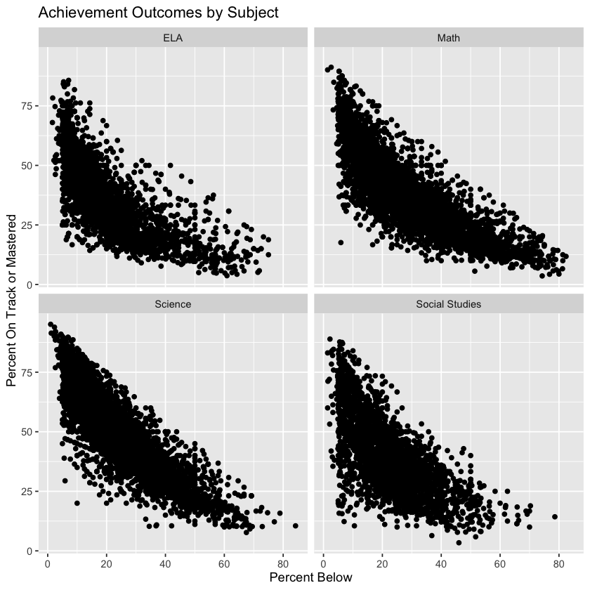

</div>

:::

:::

::: {.callout-tip}

`facet_wrap(~overall_subject)` tells `ggplot2` to split the visualization into separate panels based on the values of `overall_subject`. `wrap` means `ggplot2` arranges those panels across rows and columns to fit the available space but you can also control the arrangement of subplots

> `facet_wrap(~overall_subject, ncol = 2)`

:::

---

## Subplot Implementation in `matplotlib`

::: {.columns}

::: {.column width="45%" style="font-size:0.72em;"}

```python

ten_facet = ten[
    ten["percent_below"].notna() &
    ten["percent_on_mastered"].notna() &
    ten["overall_subject"].notna() &
    (ten["overall_subject"].str.strip() != "")
]
subjects = ten_facet["overall_subject"].unique()

fig, axes = plt.subplots(
    2,
    2,
    figsize=(5 * len(subjects), 4),
    sharex=True,
    sharey=True,
    gridspec_kw={
        "wspace": 0.4,
        "hspace": 0.5
    }
)
axes = axes.flatten()

for ax, subject in zip(axes, subjects):

    subject_data = ten_facet[
        ten_facet["overall_subject"] == subject
    ]

    ax.scatter(
        subject_data["percent_below"],
        subject_data["percent_on_mastered"]
    )

    ax.set_title(subject)
    ax.set_xlabel("% Below")
    ax.set_ylabel("% On-Track/Mastered")

fig.suptitle("Achievement Outcomes by Subject")

```

:::

::: {.column width="55%" style="font-size:0.72em;"}

<div style="height:400px; display:flex; align-items:center; justify-content:center;">

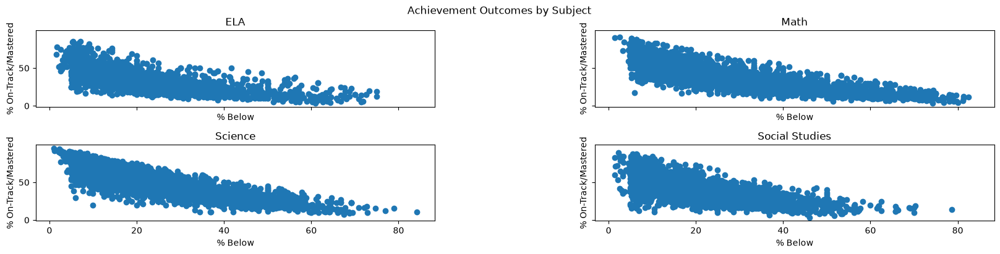

</div>

:::

:::

---

## Layering in R

::: {style="font-size:0.72em;"}

Modern graphics systems let us **layer multiple summaries** in the same coordinate system. For example: *distribution + observations + summary*

**Layer order matters:** later layers are drawn on top.

:::

::: {.columns}

::: {.column width="45%" style="font-size:0.72em;"}

```r
load("data/PluckData.RData")

# let's make a custom scale with breaks that align with our letter grade encoding
# sequence and round to get appropriate breaks
grade_breaks <- round(seq(0.33, 4.00, 1/3), 3)
x_axis <- scale_x_continuous(
    name = "Letter Grade",
    limits = c(0.00, 4.00), 
    breaks = grade_breaks,
    labels = c("F", "D-", "D", "D+", "C-", "C", "C+", "B-", "B", "B+", "A-", "A")
  )

# theme customizes the non-data components of your plot
my_theme <- theme(
    axis.text = element_text(size = 16),
    # axis.text.x = element_text(angle = 45, hjust = 1),
    axis.title = element_text(size = 18),
    plot.title = element_text(
    size = 20,
    hjust = 0.50
    )
  )

# Create histogram as *first* layer
ggplot(data = dataset, aes(x = GPA)) +
  geom_histogram( # first layer
    breaks = grade_breaks,
    color = "black", fill = "lightgrey"
  )+
  geom_boxplot( # second layer
    color = "black", fill = "lightgrey",
    aes(y = -4), width = 3
  )+ 
  geom_point( # third layer
    aes(y = -4), color = "black" # notice we used `color` rather than `fill`
  ) + x_axis + my_theme +
  labs(y = "Frequency", title = "Letter Grade Distribution")
```

:::

::: {.column width="55%" style="font-size:0.72em;"}

<div style="position: relative; width: 100%; height: 420px;"> 

<div class="fragment fade-in" style="position: absolute; top: -5; left: 0; width: 100%;">

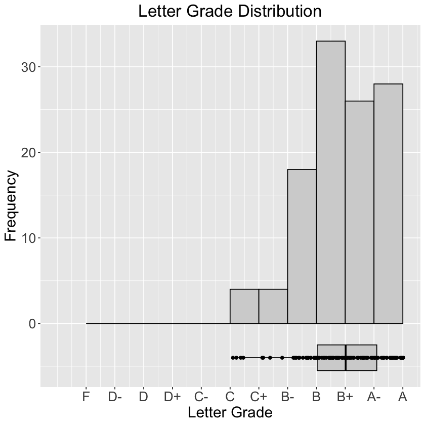

<div class="fragment fade-in" style="position: absolute; top: 0%; left: 5%; width: 88%; background: white; padding: 18px 22px; border-left: 4px solid #1565C0; box-shadow: 0 3px 12px rgba(0,0,0,0.20); font-size: 0.70em; z-index: 10;">

Here, we build the visualization in **layers**:

- `geom_histogram()` shows the overall **shape and frequency** of GPA values.
- `geom_boxplot()` adds a compact summary of the **median, quartiles, and potential outliers**.
- `geom_point()` shows the **individual observations** behind those summaries.

Because each layer represents the **same variable (`GPA`) in a different way**, combining them lets us see the overall distribution, the summary numbers and the observations that produced it.

**The order of the `geom_*()` functions matters:** later layers are drawn on top of earlier layers. <span style="color:#1565C0;"> *If the dots had to appear behind the boxplot, how will you change the code?*</span>

#### About `aes(y = -4)`

The negative positioning of the box-plot (and the scatterplot) on the y axis ensures that both appear underneath the histogram.

#### About `scale_x_continuous()`

The `scale_x_continuous()` code is **not part of the layering itself**. Here it is used to customize the x-axis by first segmenting the GPA scale with desired breaks and then translating numeric GPA values into familiar letter-grade labels displayed as `F`, `D-`, `D`, ..., `A`.

</div>

</div> 

</div>

:::

:::

---

## Layering in Matplotlib

::: {.columns}

::: {.column width="45%" style="font-size:0.72em;"}

```python
from matplotlib.ticker import FixedLocator

dataset = pd.read_csv("data/pluckclean_2.csv")
# Remove missing GPA values explicitly
gpa = dataset["GPA"].dropna()

# Set up figure
fig, ax = plt.subplots(figsize=(10, 6))

# Letter-grade axis
grade_breaks = np.round(
    np.arange(0.333, 4.001, 1 / 3),
    3
)
grade_labels = [
    "F", "D-", "D", "D+", "C-", "C",
    "C+", "B-", "B", "B+", "A-", "A"
]

# Layer 1: Histogram across full GPA range
hist_bins = np.linspace(0, 4, 11)
counts, _, _ = ax.hist(
    gpa,
    bins=hist_bins,
    color="lightgrey",
    edgecolor="black"
)

# Position boxplot below histogram
max_count = int(max(counts))
box_y = -0.12 * max_count

# Layer 2: Boxplot
ax.boxplot(
    gpa,
    vert=False,
    positions=[box_y],
    widths=max_count * 0.08,
    patch_artist=True,
    boxprops={
        "facecolor": "lightgrey",
        "edgecolor": "black"
    },
    medianprops={
        "color": "black"
    }
)

# Layer 3: Individual observations
ax.plot(
    gpa,
    np.full(len(gpa), box_y),
    "o",
    color="black",
    markersize=3
)

# X-axis
ax.set_xlim(0, 5)
ax.set_xticks(grade_breaks)
ax.set_xticklabels(grade_labels)

# Y-axis limits: allow room for boxplot
ax.set_ylim(
    box_y - max_count * 0.08,
    max_count * 1.08
)

# Explicitly define ONLY non-negative frequency ticks
y_ticks = np.arange(0, max_count + 5, 5)
ax.yaxis.set_major_locator(
    FixedLocator(y_ticks)
)
ax.set_yticklabels(
    [str(int(x)) for x in y_ticks]
)

# Labels and title
ax.set_xlabel(
    "Letter Grade",
    fontsize=18
)
ax.set_ylabel(
    "Frequency",
    fontsize=18
)
ax.set_title(
    "Letter Grade Distribution",
    fontsize=20
)
ax.tick_params(
    axis="both",
    labelsize=16
)
```

:::

::: {.column width="55%" style="font-size:0.72em;"}

<div style="position: relative; width: 100%; height: 420px;"> 
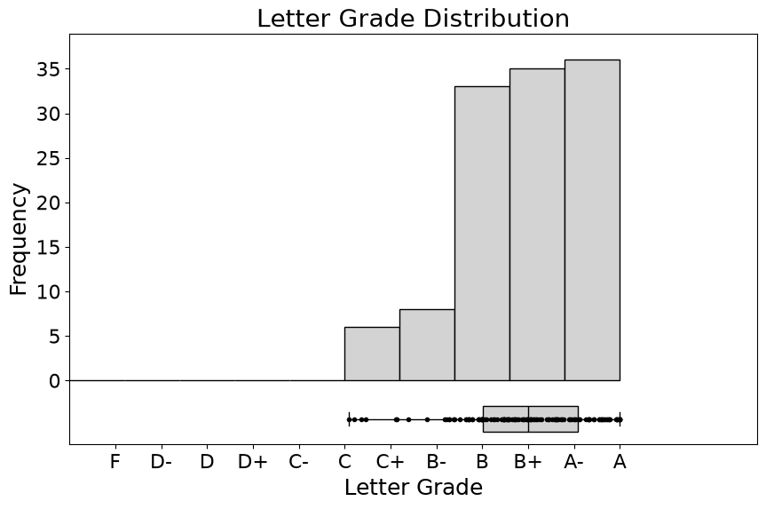
</div>

:::

:::


---

## Visualization often requires data transformation

::: {style="font-size:0.72em;"}

Good visualization often depends on good data structure.

Sometimes the data are not organized in a convenient form for the plot you want. Suppose we want to compare the distributions of **two variables**:

```text
Extraversion     Neurotocism
     17               11
     19               15
     14               12
     21               18
     ...              ...
```

The data are in wide form: each variable has its own column. But we want to use one plotting specification for both distributions, with the variable name determining the color.

For this we need the variables to be in long form: one column identifies the variable,
and another contains its values.

```text
Value        Variable

17           Extraversion
11           Neurotocism
19           Extraversion
15           Neurotocism
14           Extraversion
12           Neurotocism
      ...
```

:::

::: {.callout-tip style="font-size:0.72em;"}

### The key idea

Sometimes we reshape the data not because the data are wrong, but because
a different structure makes the visualization easier to specify.

:::

---

## Long format: the idea

::: {style="font-size:0.72em;"}

Suppose we want to compare the distributions of two achievement measures and use color to distinguish which measure each observation belongs to.<br>

In our original dataframe, the two measures are stored in separate columns. To map the type of achievement measure to color using one plotting specification, it is useful to reshape the data from wide to long form.

:::

::: {.columns .v-center}

::: {.column width="45%" style="font-size:0.72em;"}

#### R

```{r}
#| eval: false

ten_long <- ten %>%
  pivot_longer(
    cols = c(
      percent_below,
      percent_on_mastered
    ),
    names_to = "measure",
    values_to = "value"
  ) %>%
  select(
    district_name,
    school_name,
    measure,
    value
  )

ten_long
```

#### Python

```python
ten_long = ten.melt(
    value_vars=[
        "percent_below",
        "percent_on_mastered"
    ],
    var_name="measure",
    value_name="value"
)
```

:::


::: {.column width="55%" style="font-size:0.72em;"}

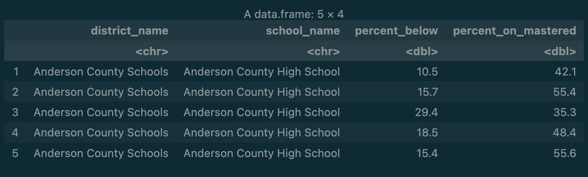

#### After transformation

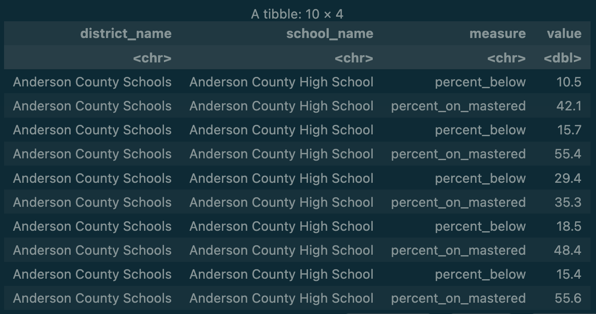

:::

:::

---

## One geometry, multiple groups

Once the data are in long form, one geometric layer can represent multiple measures.

::: {.columns .v-center}

::: {.column width="45%" style="font-size:0.72em;"}


#### R

```r
ggplot(ten_long,
       aes(x = value,
           color = measure,
           fill = measure)) +
  geom_density(alpha = 0.4)
```

#### Python

```python
import seaborn as sns
sns.kdeplot(
    data=ten_long,
    x="value",
    hue="measure",
    fill=True,
    alpha=0.4
)
```
This is a useful example of why **wrangling and visualization are connected**.

:::

::: {.column width="55%" style="font-size:0.72em;"}

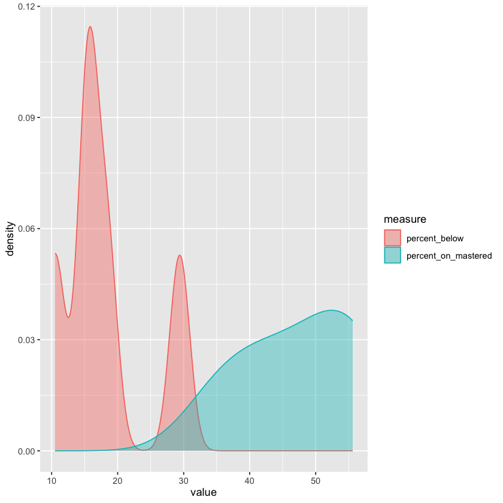

:::

:::

---

## Multiple continuous variables

::: {style="font-size:0.72em;"}

Using the `GGally` extension of `ggplot2` we can also create a scatterplot matrix for fast exploratory analysis when several numeric variables matter. <br>
What we obtain is a matrix of pair-plots that reveals the relationship between several variables all at once.

:::

::: {.columns .v-center}

::: {.column width="45%" style="font-size:0.72em;"}

#### R / `GGally`

```r
ggpairs(
  ten[, c("percent_below",
          "percent_on_mastered",
          "percent_below_previous",
          "percent_on_mastered_previous")]
)
```

#### Python / `seaborn`

```python
sns.pairplot(
    ten[[
        "percent_below",
        "percent_on_mastered",
        "percent_below_previous",
        "percent_on_mastered_previous"
    ]]
)
```
::: {.callout-warning}
Scatterplot matrices can become visually overwhelming. Use them for **exploration**, not automatically as final report figures.
:::

:::

::: {.column width="55%" style="font-size:0.72em;"}

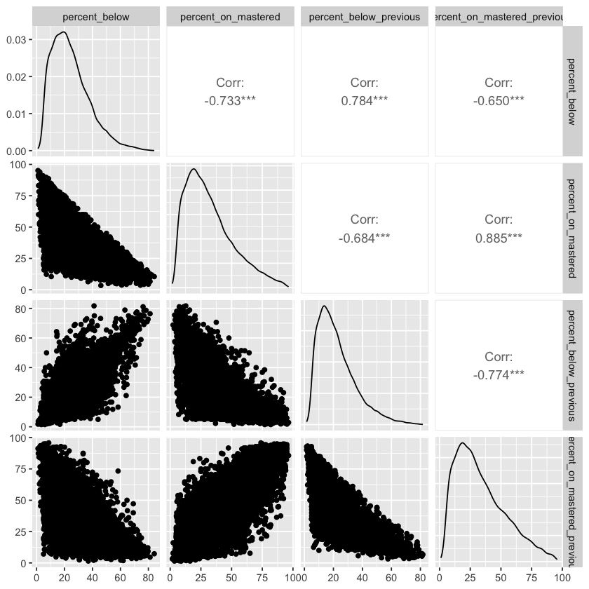

:::

:::

---

## An EDA Cheatsheet

::: {.callout-tip}

## What to plot when?

#### Distribution

- Histogram / density / boxplot<br>

#### Comparison

- Grouped boxplot / faceting / dot plot<br>

#### Relationship

- Scatterplot<br>

#### Many variables

- Scatterplot matrix<br>

:::

---

# Principles of Graphical Integrity

<span style="color:#1565C0; font-size:1.8em; font-weight:600;">
Edward Tufte <i>(Reading)</i>
</span>

---

## Tufte: graphical excellence

::: {style="font-size:0.72em;"}

Edward Tufte, a pioneering figure in Data Visualization, lays out 6 principles of graphical excellence.

[Read this blog](https://benjaminleroy.github.io/pages/blog/public/post/2018/05/16/review-of-tufte-s-the-visual-display-of-quantitative-information/) that delves into the details of his principles through a review of his seminal work: *The Visual Display of Quantitative Information*

Tufte's concern is not whether a chart is “pretty”. It is whether the graphic communicates quantitative information **clearly, precisely, and efficiently**.

A strong graphic should:

- make the important information easy to see;
- support comparison;
- reveal useful detail;
- avoid unnecessary visual burden;
- **most importantly** never mislead!

:::

---

## Tufte: show the data

The graphic should make the **data** the subject of attention.

Ask:

> What in this figure is actually carrying quantitative information?

Everything else should justify its presence by helping the reader understand that information.

---

## Tufte: data-ink

**Data-ink** is the part of a graphic that represents the data. Use it wisely!

A practical question to ask each time:

> **If I remove a certain element of my graphic, do I lose information?**

Potential non-data-ink includes:

- decorative backgrounds
- redundant borders
- excessive gridlines
- unnecessary 3-D effects
- repeated labels

::: {.callout-note}

“Remove chartjunk” does **not** mean “remove everything that is not data.” Supporting elements can improve reading. The test is whether they help the quantitative message.

:::

---

## Tufte: graphical integrity

A graphic should represent numerical relationships **truthfully**.

Watch for:

- misleading axis limits
- inconsistent scales
- distorted area or volume encodings
- missing baselines or context
- decorative perspective that changes apparent magnitude

> **The visual effect should not exaggerate the numerical effect.**

---

## The lie factor

Tufte's “lie factor” compares the scale/magnitude of the apparent effect shown in the graphic with the effect in the data.

\[
\text{Lie Factor} =
\frac{\text{size of effect shown in the graphic}}
{\text{size of effect in the data}}
\]

A value near **1** represents faithful graphical representation.

::: {.callout-tip}

For bar charts, a zero baseline is generally important because bar **length/area encodes magnitude directly**. But this isn't a universal rule, just more adhering to Tufte's principles.

:::

---

## A classic case of distortion: Truncated Axes

::: {.columns .v-center}

::: {.column width="45%" style="font-size:0.72em;"}

Suppose two values are 95 and 100.

A bar chart starting at zero shows a small difference.

A chart starting at 90 can make the same difference look enormous.

:::

::: {.column width="55%" style="font-size:0.72em;"}

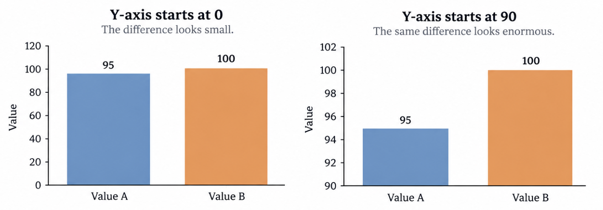

:::

:::

::: {.callout-warning}

Ask: **Is the visual design amplifying the difference beyond what the numbers justify?**

:::

---

## Data density and comparison

Good graphics can communicate **many values in a small space** while preserving readability.

Tufte emphasizes:

- comparisons across observations;
- multiple levels of detail;
- context;
- information density without distortion.

This is why **small multiples** can be powerful: repeated structure allows the eye to compare panels efficiently.

---

## 🖼️ Activity: Good plot/Bad plot

::: {.callout-tip style="font-size:0.72em;"}

## Your Turn: *With a partner*

Choose two visualizations.

> **Find a good plot and the worst plot ever.**

Critique both visualization by:

- Identifying the following

  1. What question does it appear to answer?
  2. What are the visual encodings?
  3. What does the reader notice first?
  4. What could mislead the reader?
  5. What could be removed?
  6. What could be made more explicit?

- Compare them using Tufte's ideas:

  - graphical integrity;
  - data-ink;
  - clarity;
  - ease of comparison;
  - unnecessary decoration.

:::

---

## 🗺️ A quick return to Tennessee

Our Tennessee education dataset contains achievement information across districts, schools, subjects, and student subgroups. We had already conducted some wrangling to better understand the data.

::: {.callout-tip style="font-size:0.82em;"}

### What more can be done?

1. Examine individual variables. *What does the distribution of `percent_below` look like across districts? Does any observation look out of place?*
2. Compare different groups. *How does `percent_below` differ between ELA and Math? How does it vary across `district_size` categories?*
3. Examine **change over time**. *What does the distribution of `change_below` look like? For this we may need data across several years*
4. Examine a relationship between two variables. *Is district size related to achievement outcomes?*
5. Look for patterns you might otherwise miss. *Are there particular districts, subjects, or groups that stand out?*

:::

#### 📊 Choose a visualization that helps answer a specific question about the data.

::: {style="font-size:0.82em;"}

> The goal is *not* to make a plot for every variable, the visualizations are part of a logical argumentation process.

:::

---

## 💻 Activity: EDA with Tennessee data

Return to the **analysis-ready Tennessee data** from the wrangling exercise for some further analysis. This time through plots!

::: {.callout-important style="font-size:0.82em;"}

### Explore

- the distribution of `percent_below`;
- differences between ELA and Math;
- the distribution of `change_below`;
- differences across district-size categories;
- unusual observations or patterns.

:::


#### 📉 Do not begin by choosing a chart.

::: {style="font-size:0.82em;"}

> Start by writing the research question you want the visualization to help answer.
> Explain briefly what value the visualization adds to your analysis.

:::

---

## Takeaways

1. **EDA is a way of thinking, not a list of plots.**
2. Start with the **question and the data**.
3. Choose visualizations from the **variables and comparison you need to make**.
4. Use Tufte's principles to protect **truthfulness, clarity, and efficiency**.
5. Use the Grammar of Graphics as a way to think about **data, mappings, marks, and layout**.
6. Treat visualization as part of an **iterative analytical process**.

::: {.callout-tip}

### 📚 References

- Tukey, J. W. (1977). *Exploratory Data Analysis*. Addison-Wesley.
- Tufte, E. R. (1983). *The Visual Display of Quantitative Information*. Graphics Press.
- Wilkinson, L. (2005). *The Grammar of Graphics*. Springer.
  [Book](https://link.springer.com/book/9780387245447)
- Wickham, H. et al. *ggplot2: Elegant Graphics for Data Analysis*.
  [ggplot2 book](https://ggplot2-book.org/introduction)
- [From Data to Viz](https://www.data-to-viz.com/)

:::