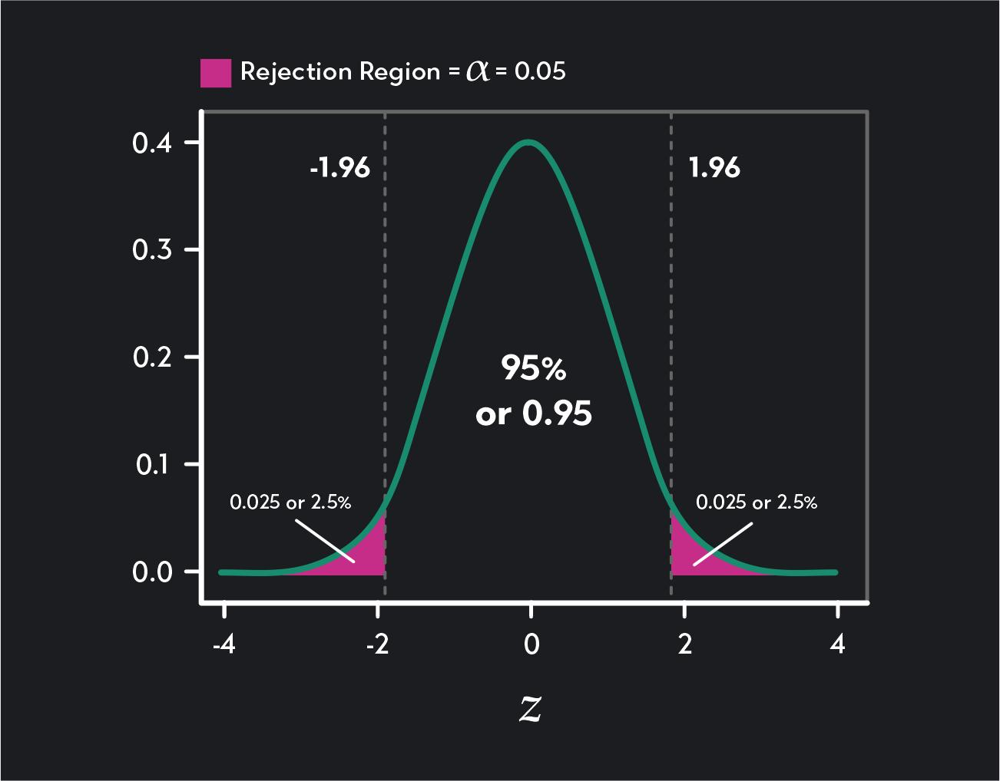

::: {style="height: 80vh; display: flex; align-items: center;"}

::: {.columns .v-center}

::: {.column width="48%"}

### UNIT 3

<span style="color:#1565C0; font-size:0.8em; font-weight:600;">Statistics Refresher</span>

<div style="font-size:0.6em;">

**Project sample knowledge on to a population**

A practical review of the logic behind inferential statistics.

</div>

:::

::: {.column width="52%" style="text-align:center;"}

{width=90%}

<br>

<small>
<em>W.E.B. Du Bois Portrait Gallery:<br>
<strong>Visualizing Black America</strong></em>
</small>

:::

:::

:::

---

## Experimental Setting

::: {style="font-size:0.62em;"}

#### Population
In statistics, often we are interested in studying phenomena that affect large groups of subjects. Usually, we do **not** observe every person, school, patient, or event we care about. The **population** of an experiment refers to all possible relevant data for the question we care about.

#### Sample
Instead we collect our experimental observations from a smaller group of subject. That is the premise of most statistical experiments -- the data we actually have

<div style="font-size:0.6em; text-align:center;">

$$
\text{sample} \longrightarrow \text{evidence} \longrightarrow \text{population}
$$

</div>

The goal of inferential statistics is to use one or more **sample statistics** to infer what is happening in a larger population of interest.

:::

<div style="position: relative; width: 100%; height: 180px;">

<div class="centerbox"
     style="
       font-size: 0.55em;
       border: 2px solid #1565C0;
       padding: 12px 20px;
       width: 45%;
       margin: 0 auto;
       text-align: center;
     ">

<strong>Population</strong><br>
what we want to know about
<br>
↓
<br>
<strong>Sample</strong><br>
what we observe

</div>

<div class="fragment fade-in"
     style="
       position: absolute;
       top: 0;
       left: 20%;
       width: 60%;
       z-index: 5;
     ">

::: {.callout-note style="font-size:0.62em; background-color: #1a80e6 !important;"}

A population can be all patients seen by a clinic, all Tennessee school districts, all customers in a market, or all units produced by a process. It does not have to mean "all humans."

:::

</div>

</div>

---

## Parameters and statistics

::: {style="font-size:0.62em;"}

A **parameter** summarizes a population.

A **statistic** summarizes a sample.

| | Population | Sample |
|---|---|---|
| Mean | $\mu$ | $\bar{x}$ |
| Proportion | $p$ | $\hat{p}$ |
| Correlation | $\rho$ | $r$ |

The statistic is observable. The parameter is usually what we want to know.

:::

::: {.callout-tip style="font-size:0.62em;"}
**Inference:** use the statistic we can calculate to learn about the parameter we care about.
:::

---

## 🩺 Waiting time in our imaginary outpatient clinic

::: {style="font-size:0.62em;"}

Suppose we want to know whether patients wait longer in **Cardiology** than in **Primary Care**.

**Population:** all relevant patients in the population of interest.

**Sample:** the patients represented in our dataset.

**Sample statistic:** the observed difference in mean waiting times for the two departments.

**Population parameter:** the corresponding difference in mean waiting times for the population.

> **Inferential question:** Is the difference we observed in the sample large enough to support a population-level claim?

:::

---

## Why can't we just look at the difference?

::: {style="font-size:0.62em;"}

Suppose our sample gives:
$$\bar{x}_{\text{PC}}-\bar{x}_{\text{Cardio}}=8\text{ minutes}$$

There are at least two explanations:

- **Real difference:** the population means genuinely differ.
- **Sampling variation:** the population means are equal, but randomness introduced through the smapling process produced an 8-minute difference.

Inferential statistics gives us a framework for distinguishing these possibilities.

:::

---

# Part 1

<span style="color:#1565C0; font-size:1.8em; font-weight:600;"> Hypotheses </span>

---

## A claim about the population

::: {style="font-size:0.62em;"}

Statistical hypotheses are statements about the **population**. The sample's role is to provide evidence in that regard.

**<span style="color:#1565C0;">Null hypothesis</span> ($H_0$)**

> Nothing distinctive is going on in the population, no difference.

**<span style="color:#1565C0;">Alternative hypothesis</span> ($H_A$)**

> The phenomenon we are observing has credence within the population; a population difference exists.

For a difference in means:
$$H_0:\mu_1-\mu_2=0$$
$$H_A:\mu_1-\mu_2\neq0$$

:::

---

## The null hypothesis is a reference point

::: {style="font-size:0.62em;"}

When beginning an experiment, do not assume that the phenomenon you are trying to establish is present. Therefore, think of the null hypothesis as a status quo: a reference point describing what we would expect to observe **if there were no effect**.

The question we typically frame in inferential statistics is:

> **If $H_0$ were true, how surprising would our observed result be?**

Hypothesis Testing is not:

> "Prove that $H_0$ is false."

Instead:

> "Assume $H_0$ and see whether the data are unusually inconsistent with it."

:::

---

## The decision: reject or fail to reject

::: {style="font-size:0.62em;"}

```text
                 Assume H0 is true
                         |
                         v
              Evaluate the observed result
                         |
                How extreme is it?
                    /            \
                   /              \
             not very            very
             extreme            extreme
                |                  |
                v                  v
        fail to reject H0       reject H0

```

:::

::: {.callout-warning style="font-size:0.62em;"}
We generally say **"fail to reject the null"**, not *"accept the null"*. A non-significant result does not prove that the null hypothesis is true. It simply indicates lack of sufficient evidence to the contrary.
:::

---

# Part 2

<span style="color:#1565C0; font-size:1.8em; font-weight:600;"> p-values: First Intuitions </span>

---

## Think about surprise

::: {style="font-size:0.72em;"}

To quantify the extremeness of our observed results under the status quo assumption, we use $p$-values.<br>

:::

::: {style="font-size:0.62em;"}

The null hypothesis says:

> **There is no difference in the population waiting time means.**

Now imagine repeatedly taking samples when this is indeed true.

Most sample differences will be relatively small. Some will be larger just because of sampling variation.

The $p$-value then asks:

> **How often would we see a result at least as extreme as the 8 minute difference we observed if the null hypothesis were true?**

:::

---

## Intuition for the p-value

::: {style="font-size:0.62em;"}

Larger $p$-values indicate less surprise:
$$p=0.20$$

A result this extreme is not especially unusual under the null model.

Smaller $p$-values indicate higher amount of surprise:

$$p=0.003$$

A result this extreme would be very unusual under the null model.

:::

<div class="centerbox">

::: {.callout-note style="font-size:0.62em;"}
<strong>Smaller p-values -> greater incompatibility between the observed result and the null model.</strong>
:::

</div>

---

## <span style="font-size:0.7em; font-weight:600;"> Formal Definition </span>: <span style="color:#1565C0; font-size:0.7em; font-weight:600;"> A Conditional Probability </span>

::: {style="font-size:0.62em;"}

**The $p$-value is the probability of obtaining a test statistic as extreme or more extreme than the observed (test) statistic, given the null hypothesis is true.**

<div style="font-size:0.62em;">
$$p=P(\text{test statistic at least as extreme as observed}\mid H_0\text{ true})$$
</div>

:::


::: {.callout-tip style="font-size:0.62em;"}

## Calculating the $p$ value

1. Assume $H_0$ is true.
2. Consider the sampling distribution of the test statistic.
3. Count outcomes at least as extreme as the observed result.

:::

::: {.callout-important style="font-size:0.62em;"}

## Things to remember

<span style="color:#1565C0;"><b>Test Statistic</b></span>: a random variable whose value can change from sample to sample. Under $H_0$ it follows a known distribution.

<span style="color:#1565C0;"><b>Observed Test Statistic</b></span>: the specific value of that random variable calculated from the sample we actually observed.

- In our waiting-time example, **the observed 8-minute difference is a sample statistic** — it describes what we found in our particular sample.
- The test statistic takes that observed difference and *standardizes it* relative to how much sample mean differences would be expected to vary under the null hypothesis. 
- The observed test statistic is the particular value of that standardized quantity calculated from our sample.

*So, the 8-minute difference tells us what we observed; the test statistic tells us how extreme that difference is relative to its expected sampling variation.*

:::

---

## What does $p < 0.05$ mean?

::: {style="font-size:0.62em;"}

Smaller $p$-values help to reject the null hypothesis. But how small is small enough? $\rightarrow$ Set a <span style="color:#1565C0;">significance threshold</span>!<br>

:::

<div style="position:relative; width:100%; height:500px;">

<!-- Base layer: significance level -->
<div style="
  position:absolute;
  top:0;
  left:0;
  width:100%;
  z-index:1;
">

::: {.columns .v-center}

::: {.column width="30%" style="font-size:0.62em;"}

#### Significance level: $\alpha$

The **significance level** is the probability of rejecting the null hypothesis when the null hypothesis is actually true: 
$$\alpha = P(\text{reject }H_0 \mid H_0\text{ is true})$$
Choosing $\alpha = 0.05$ means that, **if the null hypothesis were true**, we accept a 5% *long-run probability* of incorrectly rejecting it upon repeated sampling.
:::

::: {.column width="30%" style="font-size:0.62em;"}

{width=90%}

:::

:::

::: {style="font-size:0.62em;"}

Note that we deliberately set aside the **most extreme $5\%$ of results** within the null distribution to trigger the rejection of $H_0$.<br>

:::

</div>

<!-- Overlay layer --> 
<div class="fragment fade-in"
  style=" 
  position:absolute; 
  top:0; 
  left:0; 
  width:100%; 
  z-index:5; 
  background-color:white; 
  padding:10px 0; 
">

#### Connecting $\alpha$ to the $p$-value

::: {style="font-size:0.62em;"}

Since the $p$-value tells us **how unusual our observed result is under the null hypothesis**, it naturally follows that:

<div style="font-size:0.75em;">
$$
p < \alpha
\quad\Rightarrow\quad
\text{reject }H_0
$$
$$
p \geq \alpha
\quad\Rightarrow\quad
\text{fail to reject }H_0
$$
</div>

:::

::: {.callout-tip style="font-size:0.62em;"}

## $\alpha <->$ $p$-value

- $\alpha$ highlights **the threshold for what is unusual enough**.

- $p$-value tells us **how unusual our observed result actually is** under $H_0$.

:::
</div> 

</div>

---

## A p-value does NOT tell you

::: {style="font-size:0.62em;"}

- **how likely the result is to replicate.**  
  A small $p$-value does not mean that a similar result is guaranteed in
  another sample.

- **how large or important the effect is.**  
  Statistical significance and practical importance are different questions.

- **how much evidence exists for the alternative hypothesis.**  
  Small $p$-value means stronger evidence against $H_0$, not the
  probability of $H_A$ being true.

- **whether the result is surprising because the effect is large.**  
  A result can be statistically significant because the estimate is precise,
  even when the effect itself is very small.

- **whether the study had enough power.**  
  A non-significant result may reflect a genuinely small effect, substantial
  variability, or insufficient sample size.

::: {.callout-note}

## A p-value answers one specific question

*How unusual would a result at least this extreme be if the null hypothesis were true?*

It does **not** answer whether the effect is large, important, replicable, or true.

:::

:::

---

# Part 3

<span style="color:#1565C0; font-size:1.8em; font-weight:600;"> Effect size, significance, and power </span>

---

## Statistical significance $\neq$ Effect Size

::: {style="font-size:0.62em;"}

A p-value helps us determine whether an effect observed in a sample can be used to draw an inference about a similar effect in the population.

An effect size asks:

> **How large or strong is the phenomenon in the phenomenon?**

These are different questions.<br>

:::

::: {.callout-tip style="font-size:0.62em;"}
## A result can be **statistically significant but practically trivial**

<span style="color:#1565C0;">The Physicians Health Study of Aspirin</span> : Researchers studied a sample of 22,000 subjects over 5 years and found that taking aspirin everyday can prevent heart attack. This result was “highly statistically” significant, $p < .00001$.

However, the effect size was incredibly small. Most people did not experience the benefits of aspirin. In fact, risk of side effects nearly outweighed the “positive” preventative effect of taking aspirin.

**When effect size is small, the pros of a treatment might not outweigh the cons.**

:::

---

## Some contrasting examples

::: {style="font-size:0.62em;"}

::: {.columns .v-center}

::: {.column width="48%"}

Suppose a new patient check-in system reduces average waiting time by only
$0.2$ minutes.

With a **large sample**, even this small effect can produce a very small
$p$-value. That does not make the reduction practically important.

:::

::: {.column width="48%"}

On the other hand, suppose a small study finds: $10\text{-minute reduction; } p = 0.08$

The observed effect could be **practically important**, even though it does not meet the conventional $\alpha = 0.05$ significance threshold.

:::

:::

::: {.callout-note}

#### Why? 
We use **standard error** to standardize the sample statistic, producing an **observed test statistic** that tells us how large the observed result is relative to its expected sampling variation. (*More on this calculation later!*)<br>
Larger samples generally produce **smaller standard errors**: $SE = \frac{s}{\sqrt{n}}$

A smaller standard error could make an observed difference of a given size more extreme relative to its expected sampling variation, which can produce a smaller $p$-value.

:::

::: {.callout-tip}

## Statistical significance does not tell us whether an effect is practically important.

Always consider the **size of the effect**, not only its $p$-value. For the **same effect size** (observed difference):

| | Small study | Large study |
|---|---:|---:|
| Standard error | large | small |
| Test statistic | smaller | larger |
| $p$-value | larger | potentially very small |

:::

:::

---

## Statistical power

::: {style="font-size:0.62em;"}

I like to think of statistical power as the **true positive rate** of a hypothesis test.<br> 
It asks: **If a real effect exists, how likely is our study to detect it?**<br>
Formally, $P(\text{reject }H_0\mid H_0\text{ is false})$

Power is affected by:

::: {.columns style="font-size:0.8em; text-align:center;"}

::: {.column width="25%"}
Effect size
:::

::: {.column width="25%"}
Sample size
:::

::: {.column width="25%"}
Variability
:::

::: {.column width="25%"}
Significance level $\alpha$
:::

:::

Larger samples and larger effects generally make it easier to detect a real effect.

::: {.callout-tip}

## Think of the three concepts together

$$
\boxed{
\text{$p$-value: evidence}
\qquad
\text{effect size: magnitude}
\qquad
\text{power: sensitivity}
}
$$

:::

:::

::: { .callout-tip style="font-size:0.62em;"}

## Why sample size ($n$) matters

For a fixed effect size:

$$
n\uparrow
\quad\Rightarrow\quad
SE\downarrow
\quad\Rightarrow\quad
|z|\text{ or }|t|\uparrow
\quad\Rightarrow\quad
\text{power}\uparrow
$$

So although larger samples make smaller effects precise and easier to detect, they can also make them appear statistically significant.

:::

---

## Calculating power: A Coding Demo

::: {style="font-size:0.62em;"}

Suppose a new patient check-in system is introduced in the outpatient clinic. 

The null hypothesis is $H_0:\mu=30\text{ minutes}$ but this intervention brings the waiting time down to 28 minutes.

Before collecting the data, we want to know:

> If the population mean after the intervention really is 28 minutes, how often would our study detect that departure from the null mean of 30 minutes? 

This probability is the **statistical power** of the study. To calculate it, we need to specify:

- population mean under the null hypothesis: $\mu_0=30$ minutes;
- population mean we want the study to detect: $\mu_1=28$ minutes;
- estimated standard deviation: $\sigma=10$ minutes;
- planned sample size: $n=100$;
- significance level: $\alpha=0.05$.

:::

## Calculating power: A Coding Demo

::: { .callout-note style="font-size:0.58em;"}

## What do we intend to calculate here?

The difference we want to detect is: $\mu_1-\mu_0=28-30=-2\text{ minutes}$.<br> 
More specifically we want to compute, if the population mean really is 28 minutes, *how likely is a sample of 100 patients to give us enough evidence to reject $H_0$ at $\alpha=0.05$?*

:::

::: {.columns .v-center}

::: {.column width="48%" style="font-size:0.58em;"}

#### R
```{r}
library(pwr)
(pwr.t.test(
  n = 100,
  d = -2 / 10,
  sig.level = 0.05,
  type = "one.sample",
  alternative = "less"
))$power
```

:::

::: {.column width="48%" style="font-size:0.58em;"}

#### Python
```{python}
from statsmodels.stats.power import TTestPower

analysis = TTestPower()

analysis.solve_power(
    effect_size=-2 / 10,
    nobs=100,
    alpha=0.05,
    alternative="smaller"
)
```

:::

:::

::: {.callout-note style="font-size:0.58em;"}

## Function params to note

- Cohen's `d`/`effect_size` standardizes the effect size: $d = \frac{\mu_1-\mu_0}{\sigma}$ in standard deviations.
- `type = one.sample`: tells `pwr.t.test()` that this is a one-sample t-test. In our example, we have one sample of patients after the new system, compared against a fixed reference mean of 30 minutes.
- `alternative = less`/`alternative = smaller`: specifies the direction of the alternative hypothesis. Our research question is whether the new system reduces waiting time and hence the relevant effect will be in the left tail of the distribution.

:::

---

## Calculating power: A Coding Demo

::: {.callout-note style="font-size:0.58em;"}

## What happens when we increase our sample size?

For the same effect size, increasing the sample size makes the estimate more precise and increases the probability of detecting the effect.

:::

::: {.columns .v-center}

::: {.column width="48%" style="font-size:0.58em;"}

#### R

```{r}
sample_sizes <- c(25, 100, 400)

for (n in sample_sizes) {
  
  result <- pwr.t.test(
    n = n,
    d = -0.20,
    sig.level = 0.05,
    type = "one.sample",
    alternative = "less"
  )

  cat(
    "Sample size:", n,
    "| Power:", round(result$power, 3),
    "\n"
  )
}
```

:::

::: {.column width="48%" style="font-size:0.58em;"}

#### Python

```{python}
analysis = TTestPower()

for n in [25, 100, 400]:
    power = analysis.solve_power(
        effect_size=-0.20,
        nobs=n,
        alpha=0.05,
        alternative="smaller"
    )
    print("Sample Size: "+str(n)+"\
       Statistical Power: "+str(round(power, 3)))
```

:::

:::

---

## False positives and false negatives

::: {style="font-size:0.62em;"}

| Reality | Decision | Error |
|---|---|---|
| $H_0$ true | Reject $H_0$ | <span style="color:#1565C0;">Type I error</span>  |
| $H_0$ false | Fail to reject $H_0$ | <span style="color:#1565C0;">Type II error</span> |


The significance level is tied to Type I error:

$$
\alpha=P(\text{reject }H_0\mid H_0\text{ true})
$$

Power is related to Type II error rate ($\beta$):

$$
\text{Power}=1-\beta
$$

:::

---

# Part 4

<span style="color:#1565C0; font-size:1.8em; font-weight:600;"> How do we find these $p$-values?</span>

---

## The sampling distribution

::: {style="font-size:0.62em;"}

We know that a $p$-value tells us *how likely would we be to obtain a result at least as extreme as the one we observed if the null hypothesis were true*.<br>
To calculate that probability, we need to know:

> **What results would be expected if the null hypothesis were true?**

Imagine repeating the sampling process many times while the null hypothesis remains true. Each sample would produce a somewhat different **sample statistic** —for example, a different mean waiting time.

```text
sample 1  -> mean
sample 2  -> mean
sample 3  -> mean
   ...
sample 10000 -> mean
```

The distribution of these possible sample statistics is the **sampling distribution**.

This gives us the reference distribution we need to determine *how extreme our observed result is* and ultimately calculate its $p$-value.

:::

---

## The Central Limit Theorem

::: {style="font-size:0.62em;"}

For many settings, as sample size grows, the distribution of the **sample mean** becomes approximately normal.

$$\bar{X}\approx N\left(\mu,\frac{\sigma^2}{n}\right)$$

The exact assumptions matter, but the intuition is simple:

> **Repeated sample means tend to form an approximately bell-shaped distribution.**

:::

---

## Why the normal curve appears in so much inference

::: {style="font-size:0.62em;"}

The reference distribution lets us ask:

> **How far into the tails does our observed test statistic fall?**

```text
                 reference distribution
                         |
            -------------+-------------
          common values             extreme values
                                -> smaller tail area
                                   -> smaller p-value
```

:::

::: {.callout-tip style="font-size:0.62em;"}
The normal curve is often a model for the **sampling distribution of a statistic**, not necessarily for the raw data themselves.
:::

---

## Central Limit Theorem: a simulation

#### R

```r
population <- rexp(100000)

sample_means <- replicate(
  5000,
  mean(sample(population, 30))
)

hist(sample_means, breaks = 30)
```

#### Python

```python
import numpy as np
import matplotlib.pyplot as plt

population = np.random.exponential(100000)

sample_means = [
    np.mean(np.random.choice(population, 30))
    for _ in range(5000)
]

plt.hist(sample_means, bins=30)
plt.show()
```

::: {.callout-warning style="font-size:0.62em;"}
The code is for intuition: the population can be non-normal even though the distribution of repeated sample means becomes approximately normal.
:::

---

# Part 5

<span style="color:#1565C0; font-size:1.8em; font-weight:600;"> $z$ and $t$ statistics </span>

---

## Standardizing a sample mean: the z statistic

::: {style="font-size:0.62em;"}

When the population standard deviation $\sigma$ is known:

$$z=\frac{\bar{x}-\mu_0}{\sigma/\sqrt{n}}$$

Interpretation:

> **How many standard errors is the observed sample mean from the hypothesized mean?**

Under the null model, the statistic follows a **standard normal distribution** when the relevant assumptions are met.

:::

---

## What changes when $\sigma$ is unknown?

::: {style="font-size:0.62em;"}

Usually we do not know the population standard deviation ($\sigma$). We estimate it from the sample ($s$). Then:

$$t=\frac{\bar{x}-\mu_0}{s/\sqrt{n}}$$

Because the standard deviation is estimated, there is additional uncertainty. The reference distribution becomes the **Student's t distribution**.

:::

---

## The t distribution

::: {style="font-size:0.62em;"}

The Student's t distribution:

- is centered at 0;
- has heavier tails than the standard normal;
- depends on **degrees of freedom**;
- approaches the normal distribution as degrees of freedom increase.

For a one-sample mean test:

$$df=n-1$$

:::

::: {.callout-tip style="font-size:0.62em;"}
Smaller degrees of freedom -> heavier tails -> a more cautious reference distribution.
:::

---

## z vs. t: the practical distinction

::: {style="font-size:0.62em;"}

| | z statistic | t statistic |
|---|---|---|
| Population SD | known | unknown / estimated |
| Reference distribution | standard normal | Student's t |
| Degrees of freedom | no | yes |
| Small samples | possible when assumptions are met | especially important |
| Large samples | normal reference | t becomes close to normal |

:::

::: {.callout-note style="font-size:0.62em;"}
Do not memorize a universal rule such as "n < 30 means t." The deeper distinction is whether the population SD is known or estimated, together with the assumptions of the test.
:::

---

## Reading a t table

::: {style="font-size:0.62em;"}

A t table gives **critical values** based on:

- significance level $\alpha$;
- one or two tails;
- degrees of freedom.

For example, with:

$$\alpha=0.05,\quad n=25,\quad df=24$$

an appropriate one-tailed critical value is about:

$$t^*=1.711$$

:::

[Student's t table](https://www.tdistributiontable.com/)

::: {.callout-tip style="font-size:0.62em;"}
Before reading a t table, determine **the number of tails, $\alpha$, and degrees of freedom**.
:::

---

# Part 6

<span style="color:#1565C0; font-size:1.8em; font-weight:600;"> One-tailed vs. two-tailed tests </span>

---

## What does a tail mean?

::: {style="font-size:0.62em;"}

**Two-tailed**

> Unusually large **or** unusually small values matter.

$$H_A:\mu\neq\mu_0$$

**One-tailed**

> One direction is specified in advance.

$$
H_A:\mu>\mu_0
\qquad\text{or}\qquad
H_A:\mu<\mu_0
$$

:::

---

## Which test fits the research question?

::: {style="font-size:0.62em;"}

**Question:** Does Cardiology have a different average waiting time from Primary Care?

$$
H_A:\mu_C-\mu_P\neq0
$$

-> **Two-tailed**

**Question:** Does a new scheduling system reduce average waiting time?

$$
H_A:\mu_{new}-\mu_{old}<0
$$

-> **One-tailed**

:::

::: {.callout-warning style="font-size:0.62em;"}
Choose the tail from the research question **before examining the result**. Do not switch to one tail because the observed effect points in a convenient direction.
:::

---

## How tails affect p-values

::: {style="font-size:0.62em;"}

A two-tailed test counts extreme outcomes in **both directions**.

A one-tailed test counts extreme outcomes in **one pre-specified direction**.

```text
Two-tailed:
<--- extreme ---> | central | <--- extreme --->
                  0

One-tailed:
                  | central | <--- extreme --->
                                 direction
```

The tail choice changes the reference region and therefore the p-value.

:::

---

## Putting it all together

::: {style="font-size:0.62em;"}

```text
POPULATION
    |
  sample
    v
SAMPLE DATA
    |
    +-- statistic
    |
    +-- effect estimate
    |
    v
SAMPLING DISTRIBUTION
    |
    +-- z / t statistic
    +-- p-value
    +-- confidence interval
    |
    v
INFERENCE ABOUT POPULATION
    |
    +-- significance
    +-- effect size
    +-- uncertainty
    +-- context
```
:::

::: {style="font-size:0.62em;"}

The p-value is **one part of the argument**, not the entire argument.

:::

---

## 📝 Takeaways

::: {style="font-size:0.62em;"}

1. **Inferential statistics uses sample information to learn about a population.**
2. A **parameter** describes the population; a **statistic** describes the sample.
3. $H_0$ is a **reference model** for no effect.
4. A **p-value** tells us how extreme the observed result is under that model.
5. The **Central Limit Theorem** helps explain why normal and t-based sampling distributions appear so often for mean-based inference.
6. **z** statistics use a normal reference distribution; **t** statistics use Student's t with degrees of freedom.
7. Choose **one- vs. two-tailed tests before seeing the result**.
8. **Significance, effect size, power, and uncertainty answer different questions.**

:::

---

## 📚 References

- [Student's t-distribution table](https://www.tdistributiontable.com/)
