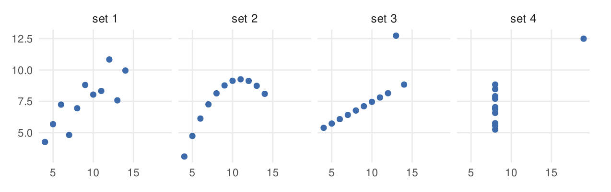
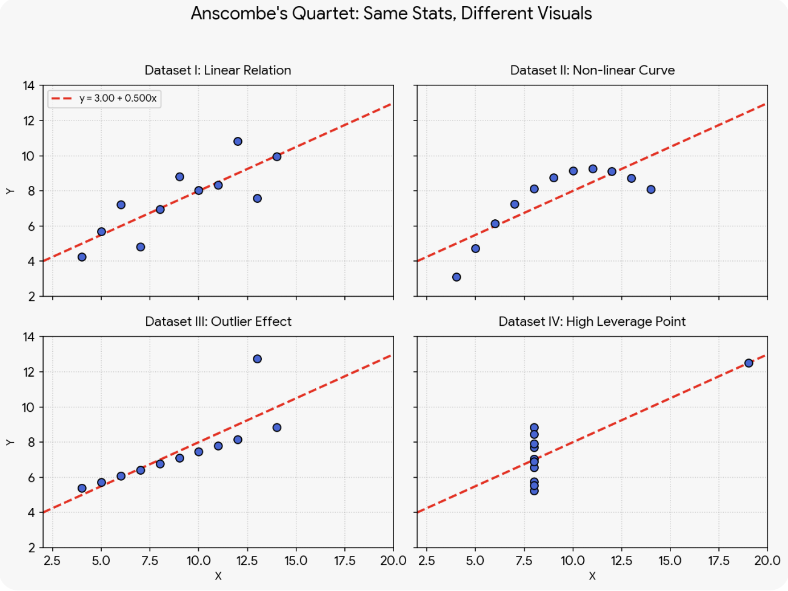
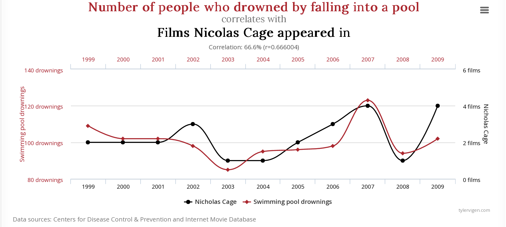
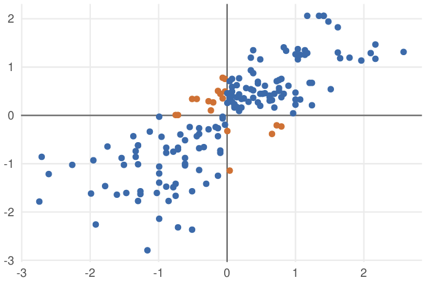
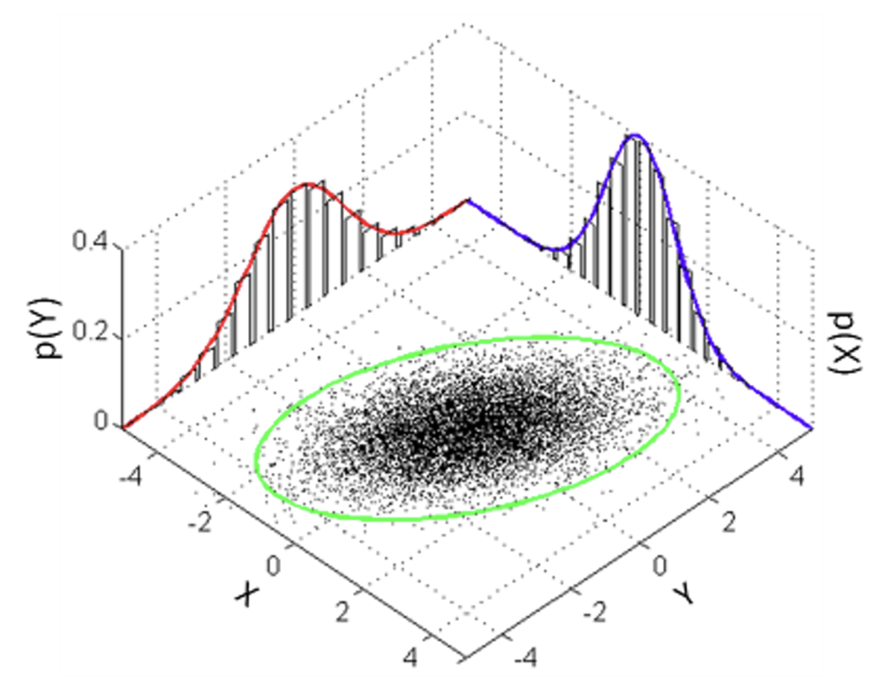

<style>
.reveal blockquote {
  margin-top: 0.2em;
  margin-bottom: 0.2em;
  padding-top: 0.1em;
  padding-bottom: 0.1em;
}
</style>


::: {style="height: 80vh; display: flex; align-items: center;"}

::: {.columns .v-center}

::: {.column width="48%"}

### UNIT 4

<span style="color:#1565C0; font-size:0.8em; font-weight:600;">Advanced Correlation Analysis</span>

<div style="font-size:0.6em;">

**Choosing the right associations**

</div>

:::

::: {.column width="52%" style="text-align:center;"}

{width=90%}

<br>

<small>
<em>W.E.B. Du Bois Portrait Gallery:<br>
<strong>Visualizing Black America</strong></em>
</small>

:::

:::

:::

---

## Learning goals

::: {style="font-size:0.56em;"}

By the end of this lecture, you should be able to:

- use correlation for **exploratory and inferential analysis**;
- recognize the **limitations** of correlation analysis;
- choose a correlation based on the **measurement scales and research question**;
- distinguish among:
  - Pearson's correlation;
  - Spearman's rank correlation;
  - point-biserial correlation;
  - tetrachoric correlation;
  - partial correlation.

:::

::: {.callout-note style="font-size:0.56em;"}

**Big idea:** there is not one universally appropriate "correlation." The statistic should match the variables and the relationship you are trying to describe.
:::

---

## What does a correlation tell us?

::: {style="font-size:0.56em;"}

A correlation is a standardized summary of association. For two variables, a correlation summarizes:

- **direction**: positive or negative;
- **strength**: how strongly the variables co-vary;
- for Pearson correlation specifically, we quantify **linear association**.


A correlation does ***not*** by itself tell us:

- whether one variable causes the other;
- whether the relationship is nonlinear;
- whether the relationship is driven by a few observations;
- whether the relationship generalizes beyond the observed sample.

:::

```{r}
#| label: setup_r
#| include: false

library(tidyverse)
```

```{python}
#| label: setup_py
#| include: false
import numpy as np
import pandas as pd
import matplotlib.pyplot as plt
```

---

## ⚛️ Motivating Example : CERN data

::: {style="font-size:0.56em;"}

Before calculating a correlation, look at the data.  CERN particle data obtained via [open source data repository](https://opendata.cern.ch/). Data consist of the total relativistic energy and momentum components along $3$ orthogonal axes of muons, a subatomic particle that is similar to an electron but is about 207 times more massive.

We want to understand whether energy and momentum are associated.

Start by reading some data.
:::

::: {.columns}

::: {.column width="50%" style="font-size:0.56em;"}

#### R

```{r}
cern_voi <- read_csv("data/cern.csv") %>%
  filter(Run == 165617) %>%
  select(E1, px1, py1, pz1)
head(cern_voi, n=5)
```

:::

::: {.column width="50%" style="font-size:0.56em;"}

#### Python

```{python}
# Read the data
cern = pd.read_csv("data/cern.csv")

# Subset Run 165617 and select variables of interest
cern_voi = cern.loc[
    cern["Run"] == 165617,
    ["E1", "px1", "py1", "pz1"]
]
cern_voi.head(5)
```

:::

:::

---

## Start with the scatterplot

::: {.columns}

::: {.column width="50%" style="font-size:0.56em;"}

#### R

```{r}
ggplot(
  cern_voi,
  aes(x = px1, y = E1)
) +
  geom_point() +
  labs(
    x = "Momentum: px1",
    y = "Energy: E1"
  )
```

:::

::: {.column width="50%" style="font-size:0.56em;"}

#### Python

```{python}
plt.scatter(
    cern_voi["px1"],
    cern_voi["E1"]
)

plt.xlabel("Momentum: px1")
plt.ylabel("Energy: E1")
plt.show()
```
:::

:::

::: {.callout-tip style="font-size:0.56em;"}

## Do not let the correlation coefficient replace the plot.

The plot tells you whether the numerical summary is an adequate description of the relationship.
:::

---

## 🔬 Pearson's correlation in CERN example

::: {style="font-size:0.56em;"}

Specifically, we wish to ask:

> **For particles with very little mass, can we predict their energy given momentum alone?**

The population parameter is:

$$
\rho = \text{population Pearson correlation}
$$

and the observed sample statistic is:

$$
 r = \text{sample Pearson correlation}.
$$

<span style="color:#1565C0;">Pearson's $r$ measures how strongly the observations follow a linear pattern.</span> In other words, magnitude of $r$ tells how close the points are to a straight line and the sign tells us about the direction of the linear trend.

On top of estimating this if you were to ask how significant is this correlation, your standard two-sided test would look like:

$$
H_0: \rho = 0
$$

$$
H_A: \rho \neq 0
$$

:::

---

## 🔬 Pearson's correlation in code

::: {.callout-note style="font-size:0.56em;"}

## Pearson's $r$

Calculate the <span style="color:#1565C0;">**linear association**</span> and run an inferential test to validate the statistical significance of the observed association.

**Exploratory:** $r$ summarizes the association in the observed sample.  
**Inferential:** a correlation test asks how unusual the observed $r$ would be under a null model such as $H_0:\rho=0$.

:::

::: {.columns}

::: {.column width="50%" style="font-size:0.56em;"}

#### R

```{r}
r_obs <- cor(
  cern_voi$E1,
  cern_voi$px1,
  use = "complete.obs",
  method = "pearson"
)

p_value <- cor.test(
  cern_voi$E1,
  cern_voi$px1,
  method = "pearson"
)$p.value

cat(r_obs, p_value)
```

:::

::: {.column width="50%" style="font-size:0.56em;"}

#### Python

```{python}
from scipy.stats import pearsonr

result = pearsonr(
    cern_voi["E1"],
    cern_voi["px1"]
)

r_obs = result.statistic
p_value = result.pvalue

print(r_obs, p_value)
```
:::

:::

::: {.callout-tip style="font-size:0.56em;"}

## Takeaway

Pearson's correlation between energy and the $x$ component of momentum is essentially zero in magnitude and not statistically significant. 

This does not imply that energy and momentum are unrelated. In fact it makes sense given the relationship between relativistic energy and total momentum is non-linear (quadratic) to begin with while Pearson's $r$ measures **linear trend**.
$$
E^2 = p^2c^2+(mc^2)^2; \qquad p^2 = p_x^2+p_y^2+p_z^2
$$

:::

---

# 2.

<span style="color:#1565C0; font-size:1.8em; font-weight:600;"> Correlation is not a complete description </span>

---

## One number, four pictures

{width=100% fig-align="center"}

::: {.callout-important style="font-size:0.56em;"}

## Guess the $r$ value

You have four datasets, each containing samples measuring two variables $X$ and $Y$. You are required to guess the value of the Pearson's $r$ that best captures the relationship between the two variables in each case.<br>
[Fill in your responses in this form](https://forms.cloud.microsoft/r/1pCLNu1PxV)

<span style="color:#1565C0;">**Remember**</span> $r$ is a value between $1$ and $-1$ where positive values indicate an association where both variables grow and shrink together. Values close to $0$ indicate no meaningful relationship.

:::

---

## Anscombe's Quartet

::: {.columns .v-center}

::: {.column width="40%" style="font-size:0.56em;"}

Created by statistician <span style="color:#1565C0;">Francis Anscombe in 1973</span>, the quartet consists of four distinct datasets that share identical summary statistics, including the correlation coefficient $r \approx 0.82$.

This is a cautionary tale that summary statistics do not tell the whole story because the scatterplots show four very different relationships.

- Set 1: A reasonably linear relationship—the setting in which Pearson’s $r$ gives a useful summary.
- Set 2: A clear curved relationship. Pearson’s $r$ can still be calculated, but it does not describe the curvature.
- Set 3: An approximately linear pattern dominated by one influential observation.

:::

::: {.column width="60%" style="font-size:0.56em;"}

{width=100% fig-align="center"}

:::

:::

::: {style="font-size:0.56em;"}

- Set 4: Almost all $x$-values are identical, with one unusual observation creating the apparent correlation.

:::

::: {.callout-tip style="font-size:0.56em;"}

## Remember

Pearson’s $r$ summarizes linear association directly from data. But nothing about it tells us whether a linear model is actually appropriate for the data.

:::

---

## Limitation 1: Pearson's Correlation measures linear association

::: {style="font-size:0.56em;"}

A Pearson correlation can be close to zero even when the variables are clearly related.

:::

::: {.columns}

::: {.column width="50%" style="font-size:0.56em;"}

```{r}
set.seed(3100)
x <- seq(-3, 3, length.out = 150)
r_obs <- cor(x, x^2,
  method = "pearson"
)
round(r_obs, 14)

plot(
  x, x^2,
  pch = 16,
  col = "grey30",
  xlab = "X",
  ylab = "Y",
  main = "A nonlinear relationship can have r close to 0"
)
```

:::

::: {.column width="50%" style="font-size:0.56em;"}

```{python}

x = np.linspace(-3, 3, 150)
y = x**2
result = pearsonr(x,y)
float(round(result.statistic, 14))

plt.scatter(x, y, s=12)
plt.xlabel("X")
plt.ylabel("Y")
plt.title("A nonlinear relationship can have r close to 0")
plt.show()
```
:::

:::

---

## Limitation 2: Outliers can dominate $r$

::: {style="font-size:0.56em;"}

A single unusual observation can substantially change a correlation. Before calculating ask:

- Is the point real or an error?
- Is it influential? (*more on this during regression analysis*)
- Does the relationship look similar without it?

```{r}
# Clean Data: Strong positive linear trend
x <- c(1, 2, 3, 4, 5, 6, 7, 8, 9, 10)
y_clean <- c(1.1, 1.9, 3.2, 3.8, 5.1, 6.0, 6.9, 8.2, 9.0, 10.1)
r_clean <- cor(x, y_clean)
cat("Clean Data Correlation (r):", round(r_clean, 4), "\n")

# Outlier Data: Change the last point from 10.1 to -50.0
y_outlier <- c(1.1, 1.9, 3.2, 3.8, 5.1, 6.0, 6.9, 8.2, 9.0, -50.0)
r_outlier <- cor(x, y_outlier)
cat("Outlier Data Correlation (r):", round(r_outlier, 4), "\n")

```

:::

::: {.callout-note style="font-size:0.56em;"}

## Practical implications

- A large $|r|$ does not guarantee a stable relationship.
- A small $|r|$ does not guarantee an absence of structure.
:::

---

## Limitation 3: Restriction of range

::: {style="font-size:0.50em;"}

If we only observe a narrow slice of the population, the observed correlation can be substantially different from the correlation in the broader population simply because the sampled observations do not span enough of the relevant range.

:::

::: {.callout-note style="font-size:0.56em;"}

## Example

Restricting an analysis to students with very similar SAT scores can attenuate the observed correlation between SAT and GPA.

:::

::: {.columns}

::: {.column width="48%" style="font-size:0.56em;"}
```{r}
# Synthetic data
sat <- c(
  1000, 1050, 1100, 1150, 1200, 1250,
  1300, 1350, 1400, 1450, 1500, 1550
)
gpa <- c(
  2.00, 2.15, 2.30, 2.45, 2.65, 3.25,
  2.65, 3.05, 3.50, 3.65, 3.80, 3.95
)

full <- data.frame(sat, gpa)
restricted <- subset(
  full,
  sat >= 1200 & sat <= 1400
)

cat("Correlation with full data: ", cor(full$sat, full$gpa))
cat("Correlation with restricted data: ", cor(restricted$sat, restricted$gpa))
```

:::

::: {.column width="52%" style="font-size:0.56em;"}

```{r}
plot(
  full$sat, full$gpa, pch = 19, col = "gray60",
  xlab = "SAT score", ylab = "GPA",
  main = "Range Restriction and Pearson's Correlation"
)
abline(v = c(1200, 1400), lty = 2)

# Highlight points within the restricted SAT range
points(restricted$sat,restricted$gpa, pch = 19, col = "red")

legend(
  "topleft",
  legend = c("Full range", "Restricted range (1200–1400)"),
  col = c("gray60", "red"), pch = 19, bty = "n"
)
```

:::

:::

---

## Limitation 4: Spurious correlation

::: {style="font-size:0.56em;"}

Two variables can move together without being meaningfully related. A shared time trend, driven by a *hidden* confounding variable, or just pure chance -- all can lead to an observed association.

:::

::: {.callout-warning style="font-size:0.56em;"}

## Correlation is not causation.

An observed correlation is evidence of association, not evidence that changing one variable causes the other.<br>
Using massive databases (like U.S. Census data alongside arbitrary tracking metrics), it is remarkably easy to fish for high-correlation coefficients.

:::


{width=100% fig-align="center"}


---

## Correlation matrices: useful, but easy to over-read

::: {style="font-size:0.56em;"}

A correlation matrix is a compact summary of many pairwise associations. It is symmetric (*values within upper and lower triangles show parity*).

It also has 1s on its diagonal because each variable is perfectly correlated with itself.

:::

::: {.columns}

::: {.column width="50%" style="font-size:0.56em;"}

#### R
```{r}
round(
  cor(
    cern_voi[, c("E1", "px1", "py1", "pz1")],
    use = "complete.obs"
  ),
  3
)
```
:::

::: {.column width="50%" style="font-size:0.56em;"}

#### Python
```{python}
cern_voi[["E1", "px1", "py1", "pz1"]].corr()
```
:::

:::


::: {.callout-tip style="font-size:0.56em;"}

## Limitations

A correlation matrix helps you **screen** many pairwise relationships but the coefficients alone do not tell us whether an association is statistically significant or substantively important, whether the relationship is appropriately described as linear, whether it is influenced by outliers, or whether it reflects a causal relationship.

:::

---

# 3. 

<span style="color:#1565C0; font-size:1.8em; font-weight:600;"> The correlation depends on the measurement scale </span>

---

## There is more than one correlation

::: {style="font-size:0.56em;"}

The appropriate correlation depends on what the variables represent.

| Variable 1 | Variable 2 | Useful starting point |
|---|---|---|
| Continuous | Continuous | Pearson or Spearman |
| Ordinal / continuous | Ordinal / continuous | Spearman |
| Binary | Continuous | Point-biserial |
| Binary | Binary | Tetrachoric, if a latent-continuous interpretation is defensible |
| Continuous | Continuous | Partial correlation when controlling for additional variables |


:::

::: {.callout-note style="font-size:0.56em;"}

## Scales of Measurement

The scales of measurement suggest that data can be viewed as one of a handful of categories.

- <span style="color:#1565C0;">Nominal</span> : identity, name, and/or categorize something or someone. does not indicate order. e.g., animals, country of residence, olympic sport
- <span style="color:#1565C0;">Ordinal</span> : convey order or rank. no equal spacing between categories. e.g., highest awarded degree, sports rankings, disagree-agree
- <span style="color:#1565C0;">Interval</span> : equal spacing in units (no true zero). differences are comparable. e.g., Celsius/Fahrenheit, calendar years, pH
- <span style="color:#1565C0;">Ratio</span> : equal spacing in units (and true zero). comparable. e.g., Kelvin, weight, speed

These categories can also be used as a basis for deciding how variables should be analyzed.

:::

---

## Pearson's $r$: a standardized measure

::: {.columns .v-center}

::: {.column width="65%" style="font-size:0.56em;"}

One representation standardizes each variable first $z_x=\frac{x-\bar x}{\sigma_x}, \qquad z_y=\frac{y-\bar y}{\sigma_y}$

then measures how standardized values move together $r = \frac{\sum z_xz_y}{n-1}$

Each axis measures a variable in $z$-scores -- *units of its standard deviations from its mean at $0$*.<br> 
A point above average on both scales, or below on both, has a positive product of its two z-scores (blue); above on one and below on the other produces a negative product (orange). $r$ is the average of these products of two $z$ scores.

:::

::: {.column width="35%" style="font-size:0.56em;"}

{width=100% fig-align="center"}

:::

:::

::: {style="font-size:0.56em;"}

We divide by $n-1$ when computing the average because we use sample standard deviations (*which uses the same*) when computing the $z$-scores. $\rightarrow$ goes back to <span style="color:#1565C0;">degrees of freedom</span> (given the sample mean, knowing $n-1$ deviations gives away the last one).

Or, $r = \frac{\sum_{i=1}^n(x_i - \bar{x})(y_i - \bar{y})}{\sqrt{\sum_{i=1}^n(x_i - \bar{x})^2}\sqrt{\sum_{i=1}^n(y_i - \bar{y})^2}} = \frac{cov(X,Y)}{\sigma_x \sigma_y}$

<span style="color:#1565C0;">Interpretation</span>: <span style="color:#898989;">**How strongly do high/low values of one variable line up with high/low values of the other, in a linear sense?**</span>

:::

---

## Pearson's  $r$

::: {style="font-size:0.56em;"}

<span style="color:#1565C0;"> **When should we use Pearson's product moment correlation coefficient?** </span>

:::

::: {.columns}

::: {.column width="60%" style="font-size:0.56em;"}

Pearson's correlation and the associated test become a natural choice when:

- both variables are quantitative
- the scientific question concerns **linear association**
  - the relationship is reasonably well represented by a straight-line pattern
- both variables approximately abide by normality
- homoscedasticity: the variance of your dependent variable should be relatively equal across all levels of the independent variable
- extreme outliers are not dominating the result

:::

::: {.column width="40%" style="font-size:0.56em;"}

{width=100%}

:::

:::

::: {.callout-note style="font-size:0.56em;"}

## Pearson’s $r$ is also the exact statistical test designed to measure the relationship between two variables measured on an interval or ratio scale. 

Here differences between values have a consistent meaning. **For example**, the difference between 160 cm and 170 cm is the same amount of height as the difference between 200 cm and 210 cm. Because these distances are equivalent, Pearson’s $r$ can use them to compare how $X$ and $Y$ change together without worrying about order and measure how closely their relationship follows a straight-line pattern.

:::

---

## Spearman's rank correlation

::: {style="font-size:0.56em;"}

<span style="color:#1565C0;"> **What changes with Spearman's rank correlation coefficient?** </span>

When we are not measuring linear relationships but rather simple monotonicity or have ranks instead of distances. Spearman's correlation evaluates whether those **ranks** move together monotonically. Conceptually, when there are not too many ties in ranks, Spearman's rank correlation coefficient can be computed as:

$$
X,Y
\quad\longrightarrow\quad
\operatorname{rank}(X),\operatorname{rank}(Y)
\quad\longrightarrow\quad
r_s = 1- \frac{6 \sum d_i^2}{n(n^2-1)} \text{, where}
$$
$$
\begin{aligned}
  d_i &= \text{difference between the two ranks for each observation } rank(X_i) \text{ and } rank(Y_i)\\ 
  n &= \text{total number of observations}
\end{aligned}
$$

It is useful when:

- variables are ordinal
- the relationship is monotonic but not necessarily linear
- outliers or non-normal measurement scales make a rank-based summary more appropriate

:::

::: {.callout-tip style="font-size:0.56em;"}

## When there are several tied ranks

If multiple data points share the same rank, they are assigned an average rank. When ties are frequent, the forumla above becomes inaccurate. Instead, you must convert the raw data to ranks and then apply the standard Pearson correlation formula to those ranks.

:::

---

## Pearson vs. Spearman: a quick demonstration

::: {.columns}
::: {.column width="50%" style="font-size:0.56em;"}

#### R

```{r}
x <- 1:10
y <- 2^x

cor(x, y, method = "pearson")
cor(x, y, method = "spearman")
```
:::

::: {.column width="50%" style="font-size:0.56em;"}

#### Python

```{python}
from scipy.stats import pearsonr, spearmanr

x = np.arange(1, 11)
y = 2**x

pearsonr(x, y).statistic
spearmanr(x, y).statistic
```
:::

:::

::: {style="font-size:0.56em;"}

The relationship is perfectly monotonic, but not linear. Spearman's rank correlation coefficient captures the monotonic ordering better.

:::

---

## Point-biserial correlation

::: {style="font-size:0.56em;"}

Point-biserial correlation ($r_{pb}$) is used when one variable is **binary** and the other is **quantitative**.<br> 
For example, if you want to understand the relationship between <span style="color:#1565C0;">Income</span> (*continuous*) and <span style="color:#1565C0;">Homeownership status</span> (*dichotomous*).

- one interval/ratio variable (e.g., test scores, height, salary)
- one nominal/ordinal variable when the categorical variable has exactly two categories (e.g., pass/fail, yes/no, male/female)

Point-biserial correlation is closely related to a *two-group comparison*. A binary variable is often just a group indicator written numerically as 0/1. So a point-biserial correlation can be interpreted as:

> **How strongly is membership in the two groups associated with the quantitative outcome?**

$$
r_{pb} = \frac{(\mu_1-\mu_0)}{\sigma_n} \sqrt{\frac{n_1n_0}{n(n-1)}}
$$
$$
\begin{aligned}
\mu_1, \mu_0 \text{ : mean of continuous variable for the two groups}\\
\sigma_n \text{ : standard dev of continuous variable}\\
n_1, n_0 \text{ : number of observations in each group}\\
n \text{ : total number of observations}
\end{aligned}
$$
:::

---

## Example dataset: Synthetic clinic data

::: {style="font-size:0.56em;"}

For this example, we use a small **synthetic clinic dataset** representing 24 patients.

- `treatment`: binary treatment indicator (`0 = no treatment`, `1 = treatment`)
- `wait_min`: patient waiting time, measured in minutes

:::

::: {.callout-tip style="font-size:0.56em;"}

## Motivating question

> Do patients who receive the treatment tend to have longer or shorter waiting times than patients who do not?


:::

::: {.columns}

::: {.column width="50%" style="font-size:0.56em;"}

#### R
```{r}
set.seed(2026)
clinic <- data.frame(
  treatment = rep(c(0, 1), each = 12),
  wait_min = c(
    42, 38, 51, 47, 44, 55, 49, 36, 46, 52, 41, 48,
    28, 35, 31, 24, 39, 33, 27, 30, 36, 25, 32, 29
  )
)
```

:::

::: {.column width="50%" style="font-size:0.56em;"}

#### Python
```{python}
clinic = pd.DataFrame({
    "treatment": [0] * 12 + [1] * 12,
    "wait_min": [
        42, 38, 51, 47, 44, 55, 49, 36, 46, 52, 41, 48,
        28, 35, 31, 24, 39, 33, 27, 30, 36, 25, 32, 29
    ]
})
```

:::

:::

---

## Point-biserial: R and Python

::: {style="font-size:0.56em;"}

Since point-biserial correlation is mathematically identical to Pearson's $r$ applied to a binary variable, you can use the built-in `cor.test()` in Base-$R$ function with `method = "pearson"`.<br> 
The test provides both the correlation coefficient and the statistical significance (p-value).

:::

::: {.columns}
::: {.column width="50%" style="font-size:0.56em;"}

#### R

```{r}
# If treatment is coded 0/1:
cor.test(
  clinic$treatment,
  clinic$wait_min,
  method = "pearson"
)
```

:::

::: {.column width="50%" style="font-size:0.56em;"}

#### Python

```{python}
from scipy.stats import pointbiserialr

pointbiserialr(
    clinic["treatment"],
    clinic["wait_min"]
)
```
:::

:::

::: {.callout-note style="font-size:0.56em;"}

## $r_{pb}$ can be equivalent to Pearson's $r$

If you assign numeric values like $0$ and $1$ to your binary variable and run a standard Pearson correlation, you will numerically get the exact same result.

:::

::: {.callout-note style="font-size:0.56em;"}

## Equivalence to independent two-sample $t$-test

The usual significance test for a point-biserial correlation gives the same $p$-value as the **equal-variance independent $t$-test** applied to the same data. Both tests ask whether the two population means are equal.

:::

---

## Tetrachoric correlation

::: {style="font-size:0.56em;"}

Here we also work with two binary variables, but a different conceptual model.

Tetrachoric correlation is used for **two binary variables** when each binary variable is understood as a thresholded version of an underlying continuous variable.

For example:

```text
latent engagement  →  low / high
latent performance →  fail / pass
```

The tetrachoric correlation estimates the association between the underlying latent continuous variables. The lecture source describes it as a correlation between two two-category nominal/ordinal variables and emphasizes the continuous conceptualization behind the observed categories.

:::

::: {.callout-warning style="font-size:0.56em;"}

**Two binary variables does not automatically mean tetrachoric correlation.** The latent-continuous interpretation is an assumption of the method.
:::

---

## Tetrachoric correlation: a $2\times2$ table

::: {.columns}

::: {.column width="50%" style="font-size:0.56em;"}

Suppose two binary variables produce:

|  | $X=0$ | $X=1$ |
|---|---:|---:|
| $Y=0$ | 38 | 10 |
| $Y=1$ | 18 | 34 |

The observed table is all we see. The tetrachoric model treats those categories as thresholded observations from underlying continuous variables. 

:::

::: {.column width="50%" style="font-size:0.56em;"}

```{r}
x_binary <- c(
  rep(0, 38),  # X=0, Y=0
  rep(1, 10),  # X=1, Y=0
  rep(0, 18),  # X=0, Y=1
  rep(1, 34)   # X=1, Y=1
)

y_binary <- c(
  rep(0, 38),  # X=0, Y=0
  rep(0, 10),  # X=1, Y=0
  rep(1, 18),  # X=0, Y=1
  rep(1, 34)   # X=1, Y=1
)
```

:::

:::

::: {style="font-size:0.56em;"}

The key question becomes:

> **How strongly associated would those latent continuous variables need to be to produce a table like this after thresholding?**

:::

---

## Tetrachoric correlation: R

::: {style="font-size:0.56em;"}

Use `polycor::polychor()` to compute the tetrachoric correlation.

```{r}
library(polycor)

output <- polycor::polychor(
  x = x_binary,
  y = y_binary,
  std.err = TRUE
)

output
```

The activity then converts the estimated correlation and its variance into a z statistic and a two-sided p-value:

```{r}
z_stat <- output$rho / sqrt(output$var)

2 * pnorm(
  abs(z_stat),
  lower.tail = FALSE
)
```
:::

---

## Tetrachoric correlation: Python

:::{style="font-size:0.56em;"}

Python does not have a direct SciPy equivalent of `polycor::polychor()`.

:::

::: {.callout-note style="font-size:0.56em;"}
This is one place where the two ecosystems are not perfectly one-to-one. The important learning objective is understanding **why** tetrachoric correlation is different, not memorizing a package name.
:::

---

## Partial correlation

::: {style="font-size:0.56em;"}

What if there is a third variable matters? Suppose:

- $X$ = alcohol consumption;
- $Y$ = life expectancy;
- $Z$ = GDP / health expenditure.

The research question is:

> **Is alcohol consumption associated with life expectancy, given GDP?**

The partial correlation asks about the relationship between $X$ and $Y$ **after accounting for their linear relationships with $Z$**.

The lecture source uses essentially this framing with the WHO life-expectancy data.

:::

---

## Intuition for partial correlation

::: {style="font-size:0.56em;"}

One way to think about it is to remove the part of each variable explained by the control variable.

```text
X  ── remove relationship with Z ──→ residual X
Y  ── remove relationship with Z ──→ residual Y

                 ↓

       correlate residual X and residual Y
```

That residual correlation is the **partial correlation of $X$ and $Y$ given $Z$**.

:::

---

## Partial correlation: R

::: {style="font-size:0.56em;"}

Use `ppcor::pcor.test()` for the inferential analysis.

```{r}
library(ppcor)
life_expectancy <- read.csv("data/life_expectancy.csv")
life_complete <- life_expectancy[
  complete.cases(
    life_expectancy[, c(
      "Alcohol",
      "Life.expectancy",
      "percentage.expenditure"
    )]
  ),
]

pcor.test(
  x = life_complete$Alcohol,
  y = life_complete$Life.expectancy,
  z = life_complete$percentage.expenditure
)
```

:::

---

## Partial correlation: Python

::: {style="font-size:0.56em;"}

A convenient implementation is available through `pingouin`:

```{python}
import pingouin as pg
life_expectancy = pd.read_csv("data/life_expectancy.csv")
life_complete = life_expectancy[
    ["Alcohol", "Life expectancy", "percentage expenditure"]
].dropna()

pg.partial_corr(
    data=life_complete,
    x="Alcohol",
    y="Life expectancy",
    covar="percentage expenditure"
)
```

The important interpretation is:

> **How strongly are $X$ and $Y$ linearly associated after accounting for $Z$?**

:::

---

# 4.

<span style="color:#1565C0; font-size:1.8em; font-weight:600;"> Choosing the right correlation </span>

---

## A decision framework

::: {style="font-size:0.56em;"}

Start with the **research question**, then inspect the variables.

:::

::: {.columns}

::: {.column width="50%" style="font-size:0.56em;"}

#### Step 1: What are the variables?

- quantitative?
- ordinal?
- binary?
- two binary variables?
- additional control variables?
:::

::: {.column width="50%" style="font-size:0.56em;"}

#### Step 2: What relationship matters?

- linear?
- monotonic?
- latent continuous association?
- association after controlling for $Z$?
:::

:::

---

## A decision framework

::: {style="font-size:0.56em;"}

| Situation | First candidate |
|---|---|
| Two quantitative variables; linear pattern | **Pearson** |
| Ordinal or monotonic relationship | **Spearman** |
| One binary + one quantitative variable | **Point-biserial** |
| Two binary variables with a defensible latent-continuous model | **Tetrachoric** |
| Two quantitative variables while controlling for another variable | **Partial Pearson** |

:::

::: {.callout-tip style="font-size:0.56em;"}

This is a **starting point, not an automatic lookup table**. Always inspect the data and ask whether the assumptions and scientific interpretation fit the coefficient.
:::

---

## The full correlation workflow

::: {style="font-size:0.56em;"}

A robust correlation analysis often looks like:

```text
Research question
      ↓
Identify variables + measurement scales
      ↓
Visualize the relationship
      ↓
Check shape, outliers, range, and coding
      ↓
Choose an appropriate correlation
      ↓
Compute the sample statistic
      ↓
If appropriate, perform the inferential test
      ↓
Interpret effect size + uncertainty + limitations
```

The activity file follows this pattern across three motivating datasets: CERN energy/momentum, Rate My Professor binary tags, and WHO life-expectancy data.

:::

---

## Activity bridge: CERN

::: {style="font-size:0.56em;"}

The source activity asks:

> **For particles with very little mass, can we predict their energy given momentum alone?**

Students first subset the data, inspect pairwise relationships, calculate Pearson correlation, test it, and then construct a 3D momentum variable from `px1`, `py1`, and `pz1`.

:::

::: {.callout-note style="font-size:0.56em;"}

The important teaching point is that the correlation is not the end of the analysis. The scatterplot and the scientifically motivated derived variable tell us much more about the relationship.
:::

---

## Activity bridge: two binary variables

::: {style="font-size:0.56em;"}

The source activity then moves to Rate My Professor and asks students to:

1. formulate a research question;
2. write formal hypotheses;
3. predict the expected direction and magnitude;
4. compute a tetrachoric correlation;
5. interpret the correlation and p-value;
6. compare the result with the prior prediction.

The activity explicitly warns against HARKing — forming the hypothesis only after seeing the results.

:::

---

## Activity bridge: partial correlation

::: {style="font-size:0.56em;"}

The third dataset contains 183 countries and multiple health-related variables.

The research question is:

> **Is there a relationship between population levels of substance use on life expectancy given GDP (expenditure)?**

Students then use the relevant variables and a partial-correlation test to answer the question.

:::

---

## What to remember

::: {.columns}

::: {.column width="50%" style="font-size:0.56em;"}

#### Correlation CAN help us

- discover associations;
- quantify their direction and strength;
- motivate further analysis;
- make controlled comparisons with partial correlation.
:::

::: {.column width="50%" style="font-size:0.56em;"}

#### Correlation CANNOT (*by itself*)

- establish causality;
- reveal nonlinear structure completely;
- protect against outliers or restriction of range;
- tell us that an association is substantively important.
:::

:::

::: {.callout-tip style="font-size:0.56em;"}

**The coefficient is only the beginning.** Understand the variables, inspect the relationship, choose the correlation deliberately, and interpret the result in context.
:::

---

## Before the activity

::: {style="font-size:0.56em;"}

Be ready to answer:

1. What is the measurement scale of each variable?
2. What kind of relationship are you trying to quantify?
3. What could make Pearson's $r$ misleading here?
4. Which correlation coefficient would you choose—and why?
5. What would a statistically significant result allow you to say, and what would it **not** allow you to say?

:::

<!-- ---

# End

::: {.center}
**Correlation is a tool for asking better questions about relationships—not a substitute for looking at the data.**
::: -->
